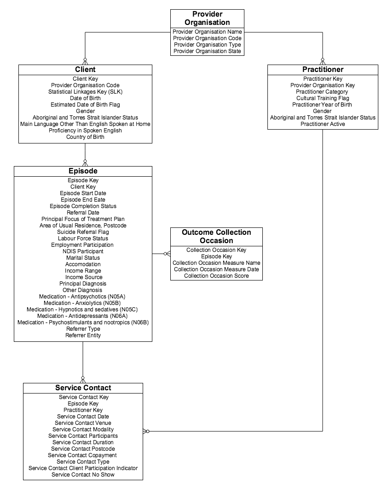

Data model and specifications
=============================

Data model
----------

   PMHC data model

Record formats
--------------

Organisation
^^^^^^^^^^^^

.. csv-table:: Organisation record layout
  :file: records/org.csv
  :header-rows: 1

.. include:: records/org-notes.rst

----------

Provider
^^^^^^^^

.. csv-table:: Provider record layout
  :file: records/pro.csv
  :header-rows: 1

.. include:: records/pro-notes.rst

----------

Client
^^^^^^

.. csv-table:: Client record layout
   :file: records/cli.csv
   :header-rows: 1

.. include:: records/cli-notes.rst

----------

Episode
^^^^^^^

.. csv-table:: Episode record layout
   :file: records/epi.csv
   :header-rows: 1
   
.. include:: records/epi-notes.rst

----------

Service event
^^^^^^^^^^^^^

.. csv-table:: Service event record layout
   :file: records/ser.csv
   :header-rows: 1
   
.. include:: records/ser-notes.rst

----------

Outcome collection occasion
^^^^^^^^^^^^^^^^^^^^^^^^^^^

.. csv-table:: Outcome collection occasion record layout
   :file: records/coloc.csv
   :header-rows: 1
   
.. include:: records/coloc-notes.rst

.. include:: includes/definitions.rst

