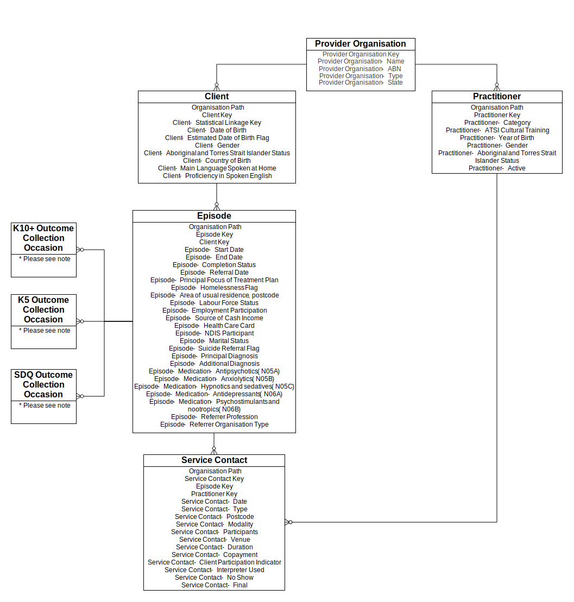

Data model and specifications
=============================

Data model
----------

   PMHC data model

Record formats
--------------

Provider Organisation
^^^^^^^^^^^^^^^^^^^^^

| Explanatory text to go here ...

.. csv-table:: Organisation record layout
  :file: record/organisation.csv
  :header-rows: 1

.. include:: record/organisation-notes.rst

----------

Practitioner
^^^^^^^^^^^^

| Explanatory text to go here ...

.. csv-table:: Practitioner record layout
  :file: record/practitioner.csv
  :header-rows: 1

.. include:: record/practitioner-notes.rst

----------

Client
^^^^^^

| Explanatory text to go here ...

.. csv-table:: Client record layout
   :file: record/client.csv
   :header-rows: 1

.. include:: record/client-notes.rst

----------

Episode
^^^^^^^

| Explanatory text to go here ...

.. csv-table:: Episode record layout
   :file: record/episode.csv
   :header-rows: 1
   
.. include:: record/episode-notes.rst

----------

Service contact
^^^^^^^^^^^^^^^

- Service contacts are defined as the provision of a service by a PHN
  commissioned mental health service provider for a client where the nature of
  the service would normally warrant a dated entry in the clinical record of
  the client.
- A service contact must involve at least two persons, one of whom must be a
  mental health service provider.
- Service contacts can be either with the client or with a third party, such as
  a carer or family member, and/or other professional or mental health worker,
  or other service provider.
- Service contacts are not restricted to face‑to‑face communication but can
  include telephone, internet, video link or other forms of direct
  communication.
- Service provision is only regarded as a service contact if it is relevant to
  the clinical condition of the client. This means that it does not include
  services of an administrative nature (e.g. telephone contact to schedule an
  appointment).

  Definition based on METeOR: `493304
  <http://meteor.aihw.gov.au/content/index.phtml/itemId/493304>`_ with
  modification.

.. csv-table:: Service contact record layout
   :file: record/service_contact.csv
   :header-rows: 1
   
.. include:: record/service_contact-notes.rst

----------

Outcome collection occasion
^^^^^^^^^^^^^^^^^^^^^^^^^^^

Items for Outcome collection occasion are still a work in progress and subject to change.

.. csv-table:: Outcome collection occasion record layout
   :file: record/outcome_collection_occasion.csv
   :header-rows: 1
   
.. include:: record/outcome_collection_occasion-notes.rst

-----

.. include:: includes/definitions.rst

