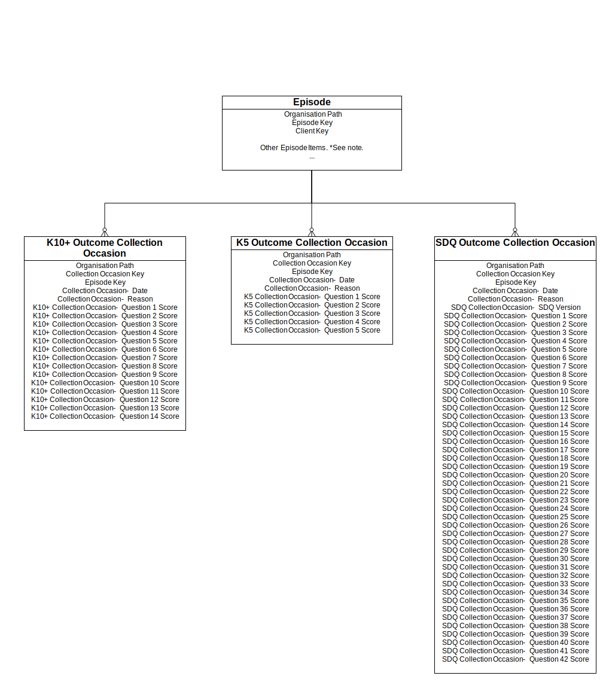

.. _data-model-and-specifications:

Data model and specifications
=============================

.. _data-model:

Data model
----------

.. _data-model-diagram:

.. figure:: figures/data-model-v2.svg
   :alt: PMHC data model

   PMHC data model

**Note:** :ref:`collection-occasion-diagram` for more details about
Collection Occasion records.

.. _collection-occasion-diagram:

   PMHC Collection Occasion data model

**Note:** See :ref:`data-model-diagram` for more details about how
Collection Occasion records fit into the overall structure.

.. _key-concepts:

Key concepts
------------

.. _key-concepts-primary-health-network:

Primary Health Network
^^^^^^^^^^^^^^^^^^^^^^

Primary Health Networks (PHNs) have been established by the Australian Government
with the key objectives of increasing the efficiency and effectiveness of
medical services for patients, particularly those at risk of poor health
outcomes, and improving coordination of care to ensure patients receive the
right care in the right place at the right time.

.. _key-concepts-provider-organisation:

Provider Organisation
^^^^^^^^^^^^^^^^^^^^^

The Provider Organisation is the business entity that the PHN has commissioned
to provide the service.

See :ref:`provider-organisation-data-elements` for the data elements for a provider organisation.

.. _key-concepts-practitioner:

Practitioner
^^^^^^^^^^^^

The Practitioner is the person who is delivering the service.

See :ref:`practitioner-data-elements` for the data elements for a practitioner.

.. _key-concepts-client:

Client
^^^^^^

The Client is the person who is receiving the service.

See :ref:`client-data-elements` for the data elements for a client.

.. _key-concepts-episode:

Episode
^^^^^^^

For the purposes of the PMHC MDS, an *Episode of Care* is defined as a more or
less continuous period of contact between a client and a PHN-commissioned
provider organisation/clinician that starts at the point of first contact, and
concludes at discharge. Episodes comprise a series of one or more Service
Contacts. This structure allows for a logical data collection protocol that
specifies what data are collected when, and by whom. Different sets of PMHC MDS
items are collected at various points in the client’s engagement with the
provider organisation. Some items are only collected once at the episode level,
while others are collected at each *Service Contact*.

Three business rules apply to how the *Episode of Care* concept is implemented
across PHN-commissioned services:

- **One episode at a time for each client, defined at the level of the provider
  organisation**

  While an individual may have multiple *Episodes of Care* over the course of
  their illness, they may be considered as being in only one episode at any
  given point of time for **any particular PHN-commissioned provider
  organisation**. The implication is that the care provided by the
  organisation to an individual client at any point in time is subject to only
  one set of reporting requirements.

- **Episodes commence at the point of first contact.** The episode start date
  will be derived from the first service contact regardless of no show state
  as long as there is a service contact that isn't a no show. Therefore, if
  there is no attended service contact the episode is uncommenced.

  Some examples:

  * If a service contact occurs on the 1/1/2018 that is recorded as a no show
    then the episode is uncommenced.
  * If a service contact occurs on the 1/1/2018 that is recorded as a no show
    and another service contact occurs on the 2/1/2018 that is attended then
    the episode start date is derived as 1/1/2018.

- **Discharge from care concludes the episode**

  Discharge may occur clinically or administratively in instances where contact
  has been lost with the client. A new episode is deemed to commence if the
  person re-presents to the organisation.

See :ref:`episode-data-elements` for the data elements for a episode.

.. _key-concepts-service-contact:

Service Contact
^^^^^^^^^^^^^^^

- Service contacts are defined as the provision of a service by a PHN
  commissioned mental health service provider for a client where the nature of
  the service would normally warrant a dated entry in the clinical record of
  the client.
- A service contact must involve at least two persons, one of whom must be a
  mental health service provider.
- Service contacts can be either with the client or with a third party, such as
  a carer or family member, and/or other professional or mental health worker,
  or other service provider.
- Service contacts are not restricted to face‑to‑face communication but can
  include telephone, internet, video link or other forms of direct
  communication.
- Service provision is only regarded as a service contact if it is relevant to
  the clinical condition of the client. This means that it does not include
  services of an administrative nature (e.g. telephone contact to schedule an
  appointment).

  Definition based on METeOR: `493304
  <http://meteor.aihw.gov.au/content/index.phtml/itemId/493304>`_ with
  modification.

.. _attended-contact:

Attended Service Contact
""""""""""""""""""""""""

An attended service contact is one that is not marked as 'No show'.

See :ref:`service-contact-data-elements` for the data elements for a service contact.

.. _key-concepts-outcome-collection-occasion:

Outcome Collection Occasion
^^^^^^^^^^^^^^^^^^^^^^^^^^^

A Collection Occasion is defined as an occasion during an Episode of Care when
the required outcome measure is to be collected. At a minimum, collection of
outcome data is required at both Episode Start and Episode End, but may be more
frequent if clinically indicated and agreed by the client.

Measures will be the Kessler Psychological Distress Scale K10+ (in the case of
Aboriginal and Torres Strait Islander clients, the K5) as well as the Strengths
& Difficulties Questionnaires.

See :ref:`outcome-collection-occasion-data-elements` for the data elements for an outcome
collection occasion.

.. _record-formats:

Record formats
--------------

.. _metadata-data-elements:

Metadata
^^^^^^^^

The Metadata table must be included in file uploads in order to identify
the type and version of the uploaded data.

.. csv-table:: Metadata record layout
   :file: record/metadata.csv
   :header-rows: 1

For this version of the specification the required content is shown in the
following table:

+--------------+------------+
| key          | value      |
+--------------+------------+
| type         | PMHC       |
+--------------+------------+
| version      | 2          |
+--------------+------------+

----------

.. _provider-organisation-data-elements:

Provider Organisation
^^^^^^^^^^^^^^^^^^^^^

See :ref:`key-concepts-provider-organisation` for the definition of a provider
organisation.

Provider Organisation data is for administrative use within the PMHC MDS
system. It is managed by the PHN's via the PMHC MDS administrative interface,
it cannot be uploaded.

.. csv-table:: Provider Organisation record layout
  :file: record/organisation.csv
  :header-rows: 1

----------

.. _practitioner-data-elements:

Practitioner
^^^^^^^^^^^^

See :ref:`key-concepts-practitioner` for the definition of a practitioner.

Practitioner data is intended to provide workforce planning data for use
regionally by the PHN and nationally by the Department. It is managed by the
provider organisations via either the PMHC MDS administrative interface or
upload.

.. csv-table:: Practitioner record layout
  :file: record/practitioner.csv
  :header-rows: 1

----------

.. _client-data-elements:

Client
^^^^^^

See :ref:`key-concepts-client` for definition of a client.

Clients are managed by the provider organisations via upload.

.. csv-table:: Client record layout
   :file: record/client.csv
   :header-rows: 1

----------

.. _episode-data-elements:

Episode
^^^^^^^

See :ref:`key-concepts-episode` for definition of an episode.

Episodes are managed by the provider organisations via upload.

.. csv-table:: Episode record layout
   :file: record/episode.csv
   :header-rows: 1

----------

.. _service-contact-data-elements:

Service Contact
^^^^^^^^^^^^^^^

See :ref:`key-concepts-service-contact` for definition of a service contact.

Service contacts are managed by the provider organisations via upload.

.. csv-table:: Service contact record layout
   :file: record/service-contact.csv
   :header-rows: 1

----------

.. _outcome-collection-occasion-data-elements:

Outcome Collection Occasion
^^^^^^^^^^^^^^^^^^^^^^^^^^^

See :ref:`key-concepts-outcome-collection-occasion` for definition of an outcome
collection occasion.

Individual item scores will eventually be required, however, it is noted that
in the short term there are issues with collecting individual item scores.
Therefore, as a transitional phase, reporting overall scores/subscales will be
allowed.

Outcome collection occasions are managed by the provider organisations via upload.

PMHC MDS requires the use of one of the following three required outcome collection occasions measures, as follows:

* **For adults (18+ years)** - Kessler Psychological Distress Scale :ref:`k10p-data-elements`
  is the prescribed measure, with the option to use the :ref:`k5-data-elements` for
  Aboriginal and Torres Strait Islander people if that is considered more appropriate.
* **For children and young people (up to and including 17 years)** - the
  Strengths & Difficulties Questionnaires (:ref:`sdq-data-elements`) is the
  prescribed tool.  The specified versions include the parent-report for 4-10
  years and 11-17 years; and the self-report for 11-17 years.

*Please note: For adolescents, clinician-discretion is allowed, and that the K10+ or K5 may be used, even though the person is under 18 years*

.. _k10p-data-elements:

K10+
""""

As noted above, reporting individual item scores will eventually be required.
In the short term, respondents can either report all 14 item scores or report
the K10 total score as well as item scores for the 4 extra items in the K10+.

.. csv-table:: K10+ record layout
   :file: record/k10p-collection-occasion.csv
   :header-rows: 1

When the client’s responses to Q1-10 are all recorded as 1 'None of the time',
they are not required to answer questions 11-14. Where a question has not been
answered please select a response of 'Not stated / missing'.

.. _k5-data-elements:

K5
""

As noted above, reporting individual item scores will eventually be required.
In the short term, respondents can either report all 5 item scores or report
the K5 total score.

.. csv-table:: K5 record layout
   :file: record/k5-collection-occasion.csv
   :header-rows: 1

.. _sdq-data-elements:

SDQ
"""

Extensive support materials are available on the SDQ developers' website,
including copies of the various versions of the instrument, background
information and scoring instructions. See http://www.sdqinfo.com. There are
six versions (parent-report and youth-self report) currently specified format
PMHC MDS reporting.

The "1" versions are administered on admission and are rated on the basis of
the proceeding 6 months. The "2" follow up versions are administered on review
and discharge and are rated on the basis of the previous 1 month period.

The versions specified for PMHC MDS reporting are:

- PC1 - Parent Report Measure for Children aged 4-10, Baseline version;
- PC2 - Parent Report Measure for Children and Adolescents aged 4-10, Follow up version;
- PY1 - Parent Report Measure for Youth aged 11-17, Baseline version;
- PY2 - Parent Report Measure for Youth aged 11-17, Follow up version;
- YR1 - Youth self report measure (11-17), Baseline version; and
- YR2 - Youth self report measure (11-17), Follow up version.

*We acknowledge that there is also a parent-report for 2-4 years; and teacher versions for all the years (2-4; 4-10 and 11-17) but that these are not to be reported the PMHC-MDS.*

Please note that the item numbering in the SDQ versions is deliberately non
sequential because it covers all items in all versions, both to indicate item
equivalence across versions and to assist data entry, especially of
translated versions. The table below indicates the items that are included in
each version, the rating periods used and the broad content covered by each
item.

+-------+-----------------------------+-------------------------------------------+---------------------+
|       | Informant                   | Parent                                    | Young Person        |
+       +-----------------------------+---------------------+----------+----------+---------------------+
|       | Age range                   | 4-10                | 11-17               | 11 - 17             |
+       +-----------------------------+----------+----------+----------+----------+----------+----------+
|       | Application                 | Baseline | Followup | Baseline | Followup | Baseline | Followup |
+       +-----------------------------+----------+----------+----------+----------+----------+----------+
|       | Rating period               | 6 months | 1 month  | 6 months | 1 month  | 6 months | 1 month  |
+-------+-----------------------------+----------+----------+----------+----------+----------+----------+
| Items | Item Content                |                           Version                               |
|       |                             +----------+----------+----------+----------+----------+----------+
|       |                             |    PC1   | PC2      | PY1      | PY2      | YR1      | YR2      |
+=======+=============================+==========+==========+==========+==========+==========+==========+
| 1-25  | Symptoms                    |     ✓    | ✓        | ✓        | ✓        | ✓        | ✓        |
+-------+-----------------------------+----------+----------+----------+----------+----------+----------+
| 26    | Overall                     | ✓        | ✓        | ✓        | ✓        | ✓        | ✓        |
+-------+-----------------------------+----------+----------+----------+----------+----------+----------+
| 27    | Duration                    | ✓        | X        | ✓        | X        | ✓        |          |
+-------+-----------------------------+----------+----------+----------+----------+----------+----------+
| 28-33 | Impact                      | ✓        | ✓        | ✓        | ✓        | ✓        | ✓        |
+-------+-----------------------------+----------+----------+----------+----------+----------+----------+
| 34-35 | Follow up progress          | X        | ✓        | X        | ✓        | X        | ✓        |
+-------+-----------------------------+----------+----------+----------+----------+----------+----------+
| 36-38 | Cross-Informant information | ✓        | X        | ✓        | X        | X        | X        |
+-------+-----------------------------+----------+----------+----------+----------+----------+----------+
| 39-42 | Cross-Informant information | X        | X        | X        | X        | ✓        | X        |
+-------+-----------------------------+----------+----------+----------+----------+----------+----------+

As noted above, reporting individual item scores will eventually be required.
In the short term, respondents can either report all 42 item scores or report
the SDQ subscale scores.

.. _scoring-the-sdq:

SDQ items and Scale Summary scores
''''''''''''''''''''''''''''''''''
The first 25 items in the SDQ comprise 5 scales of 5 items each. It is usually easiest to score all 5 scales before working out the Total Difficulties score.  For data entry, the responses to items should always be entered the same way (see below), but they are not all scored the same way.  Somewhat True is always scored as 1, but the scoring of Not True and Certainly True varies with each item (see Table 5). For each of the 5 scales the score can range from 0-10 if all 5 items were completed. Scale scores can be prorated if at least 3 items were completed.

+------------------+------------------------------------------------+----------------+----------------------+-----------------------+-----------------+
|                                                                   | Not True       | Some-what True       | Certainly True        |                 |
+-------------------------------------------------------------------+----------------+----------------------+-----------------------+                 |
| Standard Values for Data Entry                                    | 0              | 1                    | 2                     |                 |
+------------------+------------------------------------------------+----------------+----------------------+-----------------------+                 |
| Data element     | SDQ Item number and description                | Item Score                                                    | Summary Score   |
+==================+================================================+===============================================================+=================+
| *Emotional Symptoms Scale*                                                                                                        | 0-10            |
+------------------+------------------------------------------------+----------------+----------------------+-----------------------+-----------------+
| Item 03          | Often complains of headaches …                 | 0              | 1                    | 2                     |                 |
+------------------+------------------------------------------------+----------------+----------------------+-----------------------+-----------------+
| Item 08          | Many worries or often seems worried            | 0              | 1                    | 2                     |                 |
+------------------+------------------------------------------------+----------------+----------------------+-----------------------+-----------------+
| Item 13          | Often unhappy, depressed or tearful            | 0              | 1                    | 2                     |                 |
+------------------+------------------------------------------------+----------------+----------------------+-----------------------+-----------------+
| Item 16          | Nervous or clingy in new situations …          | 0              | 1                    | 2                     |                 |
+------------------+------------------------------------------------+----------------+----------------------+-----------------------+-----------------+
| Item 24          | Many fears, easily scared                      | 0              | 1                    | 2                     |                 |
+------------------+------------------------------------------------+----------------+----------------------+-----------------------+-----------------+
| *Conduct Problem Scale*                                                                                                           | 0-10            |
+------------------+------------------------------------------------+----------------+----------------------+-----------------------+-----------------+
| Item 05          | Often loses temper …                           |   0            | 1                    | 2                     |                 |
+------------------+------------------------------------------------+----------------+----------------------+-----------------------+-----------------+
| **Item 07**      | **Generally well behaved** …                   |   **2**        | **1**                | **0**                 |                 |
+------------------+------------------------------------------------+----------------+----------------------+-----------------------+-----------------+
| Item 12          | Often fights with other children …             | 0              | 1                    | 2                     |                 |
+------------------+------------------------------------------------+----------------+----------------------+-----------------------+-----------------+
| Item 18          | Often lies or cheats                           | 0              | 1                    | 2                     |                 |
+------------------+------------------------------------------------+----------------+----------------------+-----------------------+-----------------+
| Item 22          | Steals from home, school …                     | 0              | 1                    | 2                     |                 |
+------------------+------------------------------------------------+----------------+----------------------+-----------------------+-----------------+
| *Hyperactivity Scale*                                                                                                             | 0-10            |
+------------------+------------------------------------------------+----------------+----------------------+-----------------------+-----------------+
| Item 02          | Restless, overactive …                         | 0              | 1                    | 2                     |                 |
+------------------+------------------------------------------------+----------------+----------------------+-----------------------+-----------------+
| Item 10          | Constantly fidgeting …                         | 0              | 1                    | 2                     |                 |
+------------------+------------------------------------------------+----------------+----------------------+-----------------------+-----------------+
| Item 15          | Easily distracted …                            | 0              | 1                    | 2                     |                 |
+------------------+------------------------------------------------+----------------+----------------------+-----------------------+-----------------+
| **Item 21**      | **Thinks things out before acting**            | **2**          | **1**                | **0**                 |                 |
+------------------+------------------------------------------------+----------------+----------------------+-----------------------+-----------------+
| **Item 25**      | **Good attention span** …                      | **2**          | **1**                | **0**                 |                 |
+------------------+------------------------------------------------+----------------+----------------------+-----------------------+-----------------+
| *Peer Problem Scale*                                                                                                              | 0-10            |
+------------------+------------------------------------------------+----------------+----------------------+-----------------------+-----------------+
| Item 06          | Rather solitary, prefers to play alone         | 0              | 1                    | 2                     |                 |
+------------------+------------------------------------------------+----------------+----------------------+-----------------------+-----------------+
| **Item 11**      | **Has at least one good friend**               | **2**          | **1**                | **0**                 |                 |
+------------------+------------------------------------------------+----------------+----------------------+-----------------------+-----------------+
| **Item 14**      | **Generally liked by other children**          | **2**          | **1**                | **0**                 |                 |
+------------------+------------------------------------------------+----------------+----------------------+-----------------------+-----------------+
| Item 19          | Picked on or bullied …                         | 0              | 1                    | 2                     |                 |
+------------------+------------------------------------------------+----------------+----------------------+-----------------------+-----------------+
| Item 23          | Gets along better with adults …                | 0              | 1                    | 2                     |                 |
+------------------+------------------------------------------------+----------------+----------------------+-----------------------+-----------------+
| *Prosocial Scale*                                                                                                                 | 0-10            |
+------------------+------------------------------------------------+----------------+----------------------+-----------------------+-----------------+
| Item 01          | Considerate of other people’s feelings         | 0              | 1                    | 2                     |                 |
+------------------+------------------------------------------------+----------------+----------------------+-----------------------+-----------------+
| Item 04          | Shares readily with other children …           | 0              | 1                    | 2                     |                 |
+------------------+------------------------------------------------+----------------+----------------------+-----------------------+-----------------+
| Item 09          | Helpful if someone is hurt …                   | 0              | 1                    | 2                     |                 |
+------------------+------------------------------------------------+----------------+----------------------+-----------------------+-----------------+
| Item 17          | Kind to younger children                       | 0              | 1                    | 2                     |                 |
+------------------+------------------------------------------------+----------------+----------------------+-----------------------+-----------------+
| Item 20          | Often volunteers to help others …              | 0              | 1                    | 2                     |                 |
+------------------+------------------------------------------------+----------------+----------------------+-----------------------+-----------------+
| *SDQ Total Difficulties Score = Sum of Scales below*                                                                              | 0-40            |
+------------------+------------------------------------------------+---------------------------------------------------------------+-----------------+
|                  | *Emotional Symptoms Scale*                     | 0-10                                                          |                 |
+------------------+------------------------------------------------+---------------------------------------------------------------+-----------------+
|                  | *Conduct Problem Scale*                        | 0-10                                                          |                 |
+------------------+------------------------------------------------+---------------------------------------------------------------+-----------------+
|                  | *Hyperactivity Scale*                          | 0-10                                                          |                 |
+------------------+------------------------------------------------+---------------------------------------------------------------+-----------------+
|                  | *Peer Problem Scale*                           | 0-10                                                          |                 |
+------------------+------------------------------------------------+---------------------------------------------------------------+-----------------+

- *NB. Bold items indicate reverse scoring*

Scoring the SDQ
'''''''''''''''

The standard values for coding individual Item responses are 0 (Not True),
1 (Somewhat True), 2 (Certainly True) and 9 (Missing data).

For completed items (response coded 0,1,2) the Item scores are usually the same
as the standard values. Them exceptions are item 07, 11, 14, 21 and 25. These
items are "reverse-scored", that is, the standard value is mapped to Item scores
as follows: 0->2, 1->1, 2->0.

Summary scores are only calculated if at least three of the five items have been
completed (that is, coded 0, 1 or 2). Otherwise the summary score is set to
missing. For the Summary scores, the missing value used should be 99.

The Summary scores are computed using the equation shown below, with the result
being rounded to the nearest whole number. In the first 25 SDQ questions,
each summary scale is composed of five items.

Summary score = (sum of item scores/number of valid completed items) x number of items

The simplest way to calculate the total difficulties score is to add up the
following summary scores with the result being rounded to the nearest whole
number.

Total score = Emotional Scale + Conduct Scale + Hyperactivity Scale + Peer Problem Scale

However, some of the summary scores may be missing. The rule is if more than
one summary score is missing the Total Score is set to missing, value 99.

Items 28-32 are not completed if respondents have answered "No" to Item 26, which
asks for an overall opinion about difficulties being present. In this case,
all Item responses for Items 27 through 33 should be coded "8" for "not applicable",
and the impact score should be coded to zero. Item 27 is not included in the
Impact Score since it assesses the chronicity of the difficulties- the length
of time they have been present. Item 33 is not included in the Impact Score,
since it assess the burden on others rather than on the child/youth.

The coded Item Responses for the remaining Items 28 through 32 have to be
mapped to their Item Scores before adding up. This mapping is the same for all,
namely: 0->0, 1->0, 2->1, 3->2.

.. csv-table:: SDQ record layout
   :file: record/sdq-collection-occasion.csv
   :header-rows: 1

-----

.. include:: include/definitions.rst

.. _data-specifications-download:

Download Specification Files
----------------------------

Available for software developers designing extracts for the PMHC MDS, please
click the link below to download the PMHC MDS Specification files:

* `Specification zip <_static/pmhcmds-spec-meta.zip>`_
