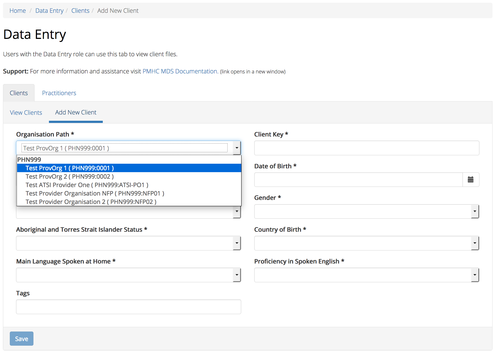
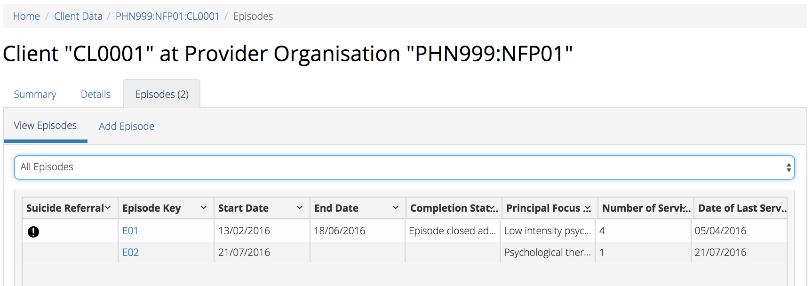
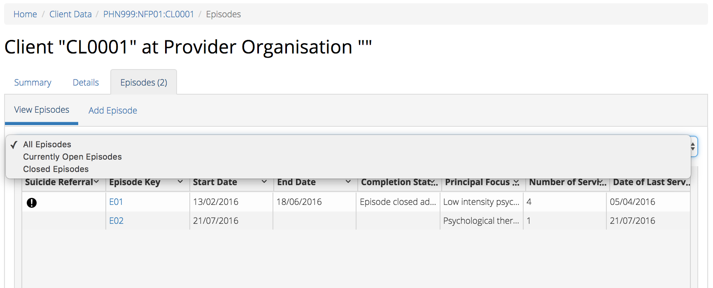
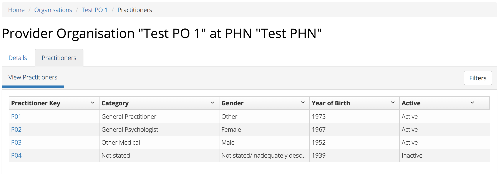
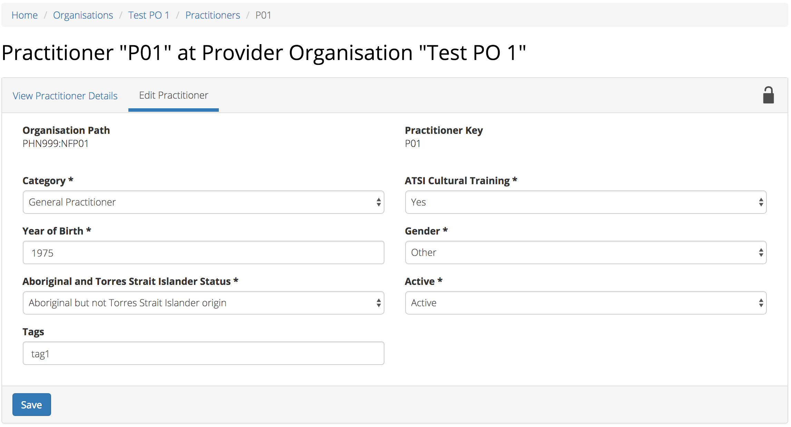
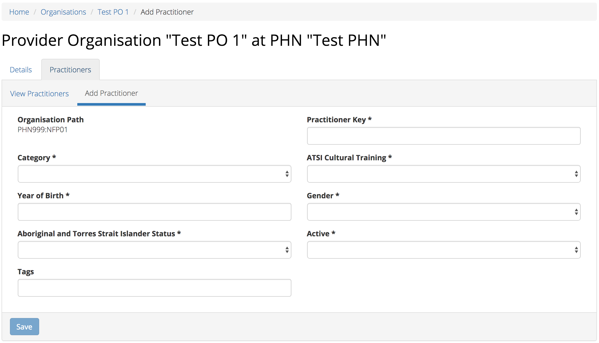

.. _data-entry:

Data Entry
===========

You will only be able to see the Data Entry tab if you have been assigned
the 'Data Entry' :ref:`roles`, when logged into the PMHC MDS on https://pmhc-mds.net.

If you don’t have access to the Data Entry tab and you believe you should, please
contact someone in your provider organisation or provider organisation's PHN
who has the 'User Management' role. If you are unsure who has the 'User Management'
role please email the PMHC Helpdesk at support@pmhc-mds.com

After navigating to the Data Entry tab, you will be presented with three search boxes
which will allow you to easily find and view the client data for the organisations
you have permission to access.

.. figure:: screen-shots/client-data.png
   :alt: Data Entry tab View

.. _client-data:

Client Data
^^^^^^^^^^^

.. _find-client:

Finding a Client
----------------

There are three :ref:`search-fields` options available to find a client.

.. _search-fields:

Search Fields
~~~~~~~~~~~~~

You can choose any one of three search options to search for a client, depending on the client information that you have available to you at the time.

- **Client Key** - You can use this field to type in a whole :ref:`dfn-client_key`, or start thereof.

- **SLK** - You can use this field to type in a client's :ref:`Statistical Linkage Key <dfn-slk>`

- **DOB** - You can use this field to type in a client's :ref:`dfn-date_of_birth`.

.. figure:: screen-shots/client-search-fields.png
   :alt: Client Data Search Fields

After entering information into one of these :ref:`search-fields`, simply click
the blue 'Search' button to see :ref:`search-client`

Use the grey 'Clear Search' button to removed any previously entered text.

.. _search-client:

Client Search Results
---------------------

A display of the details used within the :ref:`search-fields` used in :ref:`find-client`
will be visible above the search results table, when results are available.

You can sort the listed client search results through either of the
above three search features for :ref:`search-fields`.

Sort the listed clients by simply clicking on the column header. Alternately
you can click on the arrow beside a column header for more sort options, as follows:

- Sort Ascending
- Sort Descending
- Remove Sort
- Hide Column

.. figure:: screen-shots/client-search-results.png
   :alt: Client Data Search Results

To filter the listed clients:

  1. Click the grey 'Filters' button.
  2. Start typing in an edit box now displayed under the column headers.
  3. To remove the filter, click the grey cross within the edit box beside any entered text or click the grey 'Filters' button.

.. figure:: screen-shots/client-search-results-filter.png
   :alt: Client Data Search Results Filtered

You can clear the search results and start a new search by clicking on the blue
'Edit Search' button.

.. _view-client-details:

Viewing a Client's details
--------------------------

You can view a clients's details through the :ref:`search-client`
available on the Data Entry tab, by following these steps:

1. Create :ref:`search-client`
2. Click on the Client Key in blue displayed within the table list.
3. This is the Client's summary view, with summary details along with a
   snapshot of the five most recent episodes.

.. figure:: screen-shots/client-view-summary.png
   :alt: Client Data Summary View

4. Click Details tab for more information on the Client.

A page will display the Client's details as recorded via the :ref:`Client Data Elements <client-data-elements>`.

.. figure:: screen-shots/client-view-details.png
   :alt: Client Data Details View

.. _edit-client:

Editing a Client
----------------

You can edit a clients's details through the :ref:`search-client`
available on the Data Entry tab, by following these steps:

1. Create :ref:`search-client`
2. From the Client Search table, click the Client Key.
3. Click Details tab, to view Client's details.
4. Click Edit Details tab.
5. Update the Client's details. Mandatory fields are marked with an * (Specification :ref:`Client Data Elements <client-data-elements>`)
6. Click the blue 'Save' button. (If you decide not to save changes, you can simply navigate away from this screen)

.. figure:: screen-shots/client-edit-details.png
   :alt: Client Data Edit Details

You will receive confirmation that the Client's details have been saved, and it will
now be displaying these new details in the Clients View Details tab.

.. _add-client:

Adding a New Client
-------------------

You can add a clients through the :ref:`search-client`
available on the Data Entry tab, by following these steps:

1. Create :ref:`search-client`
2. Firstly double check the client is not already added.
3. Click the blue 'Add New Client' button.
4. Choose the Provider Organisation from the drop down list.
5. Enter the Client's details. Mandatory fields are marked with an * (Specification :ref:`Client Data Elements <client-data-elements>`)
6. Click the blue 'Save' button. (If you decide not to add this client, you can simply navigate away from this screen)

You will receive confirmation that the Client has been saved, and it will
now be displaying the client's saved information in the Clients View Details tab.

.. _delete-client:

Deleting a Client
-----------------

You can not currently delete a client. The client delete feature will be released in July 2017.

In the interim, if this causes you any significant issues please email support@pmhc-mds.com.

.. _episode-data:

Episodes
^^^^^^^^

.. _view-episodes:

Viewing a Client's Episodes
---------------------------

You can view a clients's episodes through the :ref:`view-client-details`
available on the Data Entry tab, by following these steps:

1. Once :ref:`view-client-details`
2. From the Client's Summary tab, you can shortcut straight to an episode by clicking
   the Blue Episode Key displayed in the snapshot of the five most recent episodes.

.. figure:: screen-shots/client-view-summary.png
   :alt: Client Data Summary View

3. Alternately, if you would like to view all episodes you can click on the
   Episode Tab. The heading for this tab displays in brackets the total number of episodes recorded
   in the PMHC MDS for this client at Provider Organisations for which you have access.

A table will display all the Client's Episodes at Provider Organisations for which you have access.

A Drop down list is available to view:

* All Episodes
* Currently Open Episodes
* Closed Episodes

4. To view the Client's Episode details, click the Blue Episode Key.

.. figure:: screen-shots/client-episodes-details.png
   :alt: Client Episodes Details View

A page will display the Client's Episode details as recorded via the :ref:`Episode Data Elements <episode-data-elements>`.

.. _edit-episode:

Editing a Client's Episode data
-------------------------------

You can edit a Client's Episode details through the :ref:`view-client-details`
available on the Data Entry tab, by following these steps:

1. Once :ref:`view-episodes`
2. From the Client's Episode table, click the Episode Key.
3. Click Edit Details tab.
4. Update the Client's Episode details. Mandatory fields are marked with an * (Specification :ref:`Episode Data Elements <episode-data-elements>`)
5. Click the blue 'Save' button. (If you decide not to save changes, you can simply navigate away from this screen)

.. figure:: screen-shots/client-episodes-edit.png
   :alt: Client Episodes Edit Details

You will receive confirmation that the Client's Episode details have been saved,
and it will now be displaying these new details in the Episode View Details tab.

.. _add-episode:

Adding a Client's Episode data
------------------------------

You can add a clients through the :ref:`view-client-details`
available on the Data Entry tab, by following these steps:

1. Once :ref:`view-episodes`
2. Firstly double check the client does not have any open episode already showing. (A client can only have one open episode at a provider organsiation. :ref:`key-concepts-episode`)
3. Click the Add Episode tab.
4. Enter the Client's Episode details. Mandatory fields are marked with an * (Specification :ref:`Episode Data Elements <episode-data-elements>`)
5. Click the blue 'Save' button. (If you decide not to add this client's episode, you can simply navigate away from this screen)

.. figure:: screen-shots/client-episodes-add.png
   :alt: Client Data Add Episode

You will receive confirmation that the Client's Episode details have been added,
and it will now be displaying these new details in the Episode View Details tab.

.. _delete-episode:

Deleting an Episode
-------------------

You can not currently delete a client's episode. The episode delete feature will be released in July 2017.

In the interim, if this causes you any significant issues please email support@pmhc-mds.com.

.. _service-contact-data:

Service Contacts
^^^^^^^^^^^^^^^^

.. _view-service-contact:

Viewing a Client's Service Contacts for an Episode
--------------------------------------------------

You can view a client's service contacts through the :ref:`view-episodes`
available on the Data Entry tab, by following these steps:

1. Once :ref:`view-episodes`
2. From the Client's Episode Details tab, click the Service Contacts Tab.
   The heading for this tab displays in brackets the total number of service contacts recorded
   in the PMHC MDS for this episode.

A table will display all the Service Contacts linked to this Client's Episode.

.. figure:: screen-shots/client-service-contacts-view.png
   :alt: Client Episode Service Contacts Table View

3. To view the Service Contacts details, click the Blue Service Contact Key.

.. figure:: screen-shots/client-service-contacts-details.png
   :alt: Client Episode Service Contacts Details View

A page will display the Service Contacts details as recorded via the :ref:`Service Contact Data Elements <service-contact-data-elements>`.

.. _edit-service-contact:

Editing a Client's Service Contacts for an Episode
--------------------------------------------------

You can edit a client's service contacts through the :ref:`view-episodes`
available on the Data Entry tab, by following these steps:

1. Once :ref:`view-service-contact`
2. From the Service Contacts table, click the Service Contact Key.
3. Click Edit Service Contact tab.
4. Update the Client's Service Contact details for that episode. Mandatory fields are marked with an * (Specification :ref:`Service Contact Data Elements <service-contact-data-elements>`)
5. Click the blue 'Save' button. (If you decide not to save changes, you can simply navigate away from this screen)

.. figure:: screen-shots/client-service-contacts-edit.png
   :alt: Client Service Contact Edit Details

You will receive confirmation that the Client's service contact details have been saved,
and it will now be displaying these new details in the View service Contact Details tab.

.. _add-service-contact:

Adding a Client's Service Contact data
--------------------------------------

You can edit a client's service contacts through the :ref:`view-episodes`
available on the Data Entry tab, by following these steps:

1. Once :ref:`view-service-contact`
2. Firstly double check the service contact is not already showing.
3. Click the Add Service Contact tab.
4. Enter the Client's Service Contact details for that episode. Mandatory fields are marked with an * (Specification :ref:`Service Contact Data Elements <service-contact-data-elements>`)
5. Click the blue 'Save' button. (If you decide not to add this client's episode, you can simply navigate away from this screen)

.. figure:: screen-shots/client-service-contacts-add.png
   :alt: Client Data Add Service Contact

You will receive confirmation that the Client's service contact details have been added,
and it will now be displaying these new details in the View service Contact Details tab.

.. _delete-service-contact:

Deleting an Service Contact
---------------------------

You can not currently delete a client's service contact for an episode. The
service contact delete feature will be released in July 2017.

In the interim, if this causes you any significant issues please email support@pmhc-mds.com.

.. _outcome-collection-occasion-data:

Outcome Collection Occasions
^^^^^^^^^^^^^^^^^^^^^^^^^^^^

.. _view-client-collection-occasion:

Viewing a Client's Outcome Collection Occasions for an Episode
--------------------------------------------------------------

You can view a clients's outcome collection occasions through the :ref:`view-episodes`
available on the Data Entry tab, by following these steps:

1. Once :ref:`view-episodes`
2. From the Client's Episode Details tab, click the Collection Occasions Tab.
   This tab displays in brackets the total number of collection occasions recorded
   in the PMHC MDS for this episode.

A table will display all the Collection Occasions linked to this Client's Episode.

.. figure:: screen-shots/client-collection-occasions-view.png
   :alt: Client Episode Collection Occasions Table View

3. To view the Collection Occasions details, click the Blue Service Contact Key.

.. figure:: screen-shots/client-collection-occasions-details.png
   :alt: Client Episode Collection Occasions Details View

A page will display the Collection Occasions details as recorded via the
:ref:`Outcome Collection Occasion Data Elements <outcome-collection-occasion-data-elements>`.

.. _add-client-collection-occasion:

Adding a Client's Outcome Collection Occasions data
---------------------------------------------------

The Data Entry Interface is due to be fully integrated into the PMHC MDS
in the coming weeks.

An update will be circulated to all current users and the mailing list
when this new feature is added.

.. _practitioner:

Practitioners
^^^^^^^^^^^^^

.. _find-practitioner:

Finding a Practitioner
----------------------

You can search for practitioners assigned to an organisation through the
Data Entry tab, by following these steps:

1. Click on the Practitioners tab.

.. _view-practitioner:

Viewing a Practitioner
----------------------

You can view a practitioner's details through :ref:`find-practitioner`
on the Data Entry tab, by following these steps:

1. Once :ref:`find-practitioner`
2. Click on the practitioner's key in blue displayed within the table list.

.. figure:: screen-shots/practitioner-details.png
   :alt: PMHC MDS Practitioner Details View

Please note: You can also view a practitioner's details through the 'Client Data' tab.
See :ref:`view-practitioner-details`

.. _view-practitioner-details:

Viewing a Practitioner Providing Client Services
------------------------------------------------

You can view a practitioner's details through :ref:`view-service-contact`
on the Data Entry tab, by following these steps:

1. Once :ref:`view-service-contact`
2. From the Service Contacts Details tab, click the Practitioner Key.

.. figure:: screen-shots/client-service-contacts-practitioner-key.png
   :alt: Practitioner Key on Service Contacts Details

A page will display the Practitioner's details as recorded via the :ref:`Practitioner Data Elements <practitioner-data-elements>`.

.. figure:: screen-shots/practitioner-details.png
   :alt: Practitioner Details View

.. _edit-practitioner:

Editing a Practitioner
----------------------

You can edit a practitioner's details through the organisation tab, by following these steps:

1. Once :ref:`view-practitioner`
2. From the View Practitioner Details tab, click the Edit Details tab.
3. Update the practitioner's details. Mandatory fields are marked with an *
4. Click the blue 'Save' button.

.. _add-practitioner:

Adding a Practitioner
----------------------

You can add a practitioner's details through the organisation tab, by following these steps:

1. Once :ref:`find-practitioner`
2. From the Practitioners tab, click the Add New Practitioner tab.
3. Enter the practitioner's details. Mandatory fields are marked with an *
4. Click the blue 'Save' button.

Alternately, practitioner records can be uploaded in bulk. See :ref:`upload`

.. _delete-practitioner:

Deleting a Practitioner
-----------------------

Currently a practitioner can not be deleted from the PMHC MDS. However, you can
change the practitioner from active to inactive by editing their details.

See :ref:`edit-practitioner`
