.. _data-entry:

Data Entry
===========

You will only be able to see the Data Entry tab if you have been assigned
the 'Data Entry' :ref:`roles`, when logged into the PMHC MDS on https://pmhc-mds.net.

If you don’t have access to the Data Entry tab and you believe you should, please
contact someone in your provider organisation or provider organisation's PHN
who has the 'User Management' role. If you are unsure who has the 'User Management'
role please email the PMHC Helpdesk at support@pmhc-mds.com

After navigating to the Data Entry tab, you will be presented with three search
boxes which will allow you to easily find and view the client data for the
organisations you have permission to access.

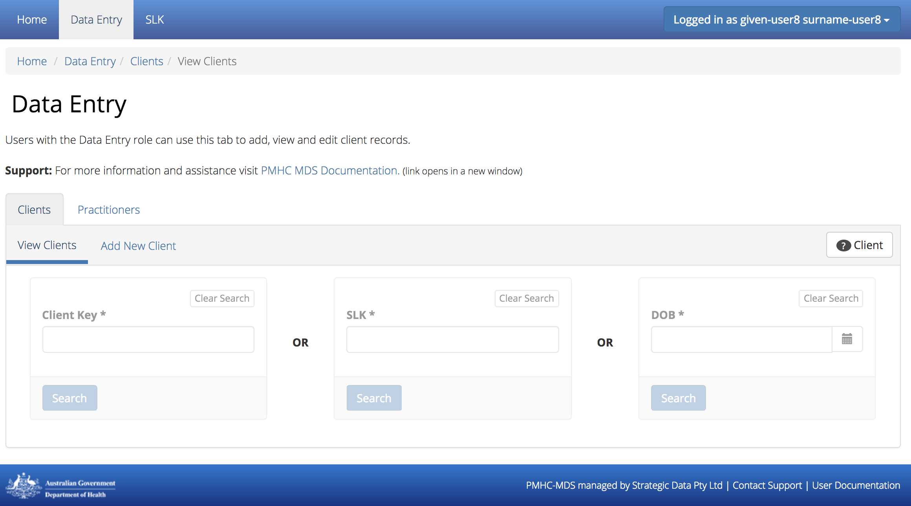

.. _client-data:

Client Data
^^^^^^^^^^^

.. _find-client:

Finding a Client
----------------

There are three :ref:`search-fields` options available to find a client.

.. _search-fields:

Search Fields
~~~~~~~~~~~~~

You can choose any one of three search options to search for a client, depending
on the client information that you have available to you at the time.

- **Client Key** - You can use this field to type in a whole :ref:`dfn-client_key`, or start thereof.

- **SLK** - You can use this field to type in a client's :ref:`Statistical Linkage Key <dfn-slk>`

- **DOB** - You can use this field to type in a client's :ref:`dfn-date_of_birth`.

.. figure:: screen-shots/client-search-fields.png
   :alt: Client Data Search Fields

After entering information into one of these :ref:`search-fields`, simply click
the blue 'Search' button to see :ref:`search-client`

Use the grey 'Clear Search' button to removed any previously entered text.

.. _search-client:

Client Search Results
---------------------

A display of the details used within the :ref:`search-fields` used in :ref:`find-client`
will be visible above the search results table, when results are available.

You can sort the listed client search results through either of the
above three search features for :ref:`search-fields`.

Sort the listed clients by simply clicking on the column header. Alternately
you can click on the arrow beside a column header for more sort options, as follows:

- Sort Ascending
- Sort Descending
- Remove Sort
- Hide Column

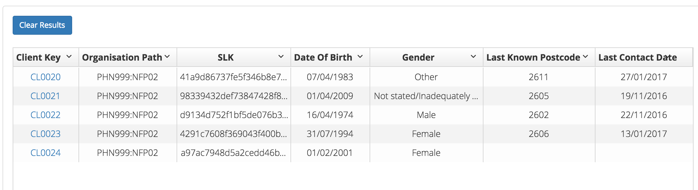

To filter the listed clients:

  1. Click the grey 'Filters' button.
  2. Start typing in an edit box now displayed under the column headers.
  3. To remove the filter, click the grey cross within the edit box beside any entered text or click the grey 'Filters' button.

.. figure:: screen-shots/client-search-results-filter.png
   :alt: Client Data Search Results Filtered

You can clear the search results and start a new search by clicking on the blue
'Edit Search' button.

.. _view-client-details:

Viewing a Client's details
--------------------------

You can view a clients's details through the :ref:`search-client`
available on the Data Entry tab, by following these steps:

1. Create :ref:`search-client`.
2. Click on the Client Key in blue displayed within the table list.
3. This is the Client's summary view, with summary details along with a
   snapshot of the five most recent episodes.

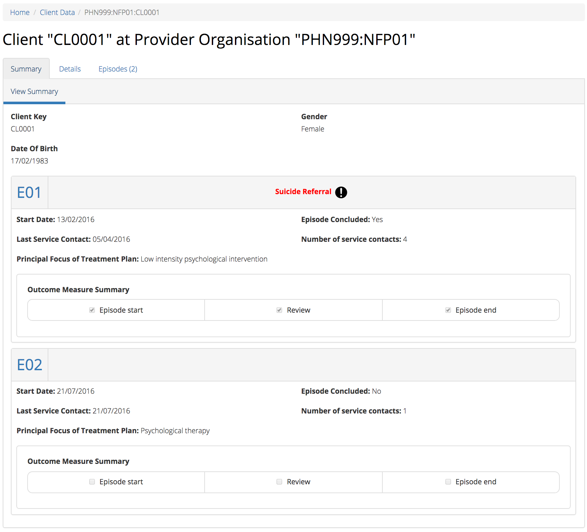

4. Click Details tab for more information on the Client.

A page will display the Client's details as recorded via the :ref:`Client Data Elements <client-data-elements>`.

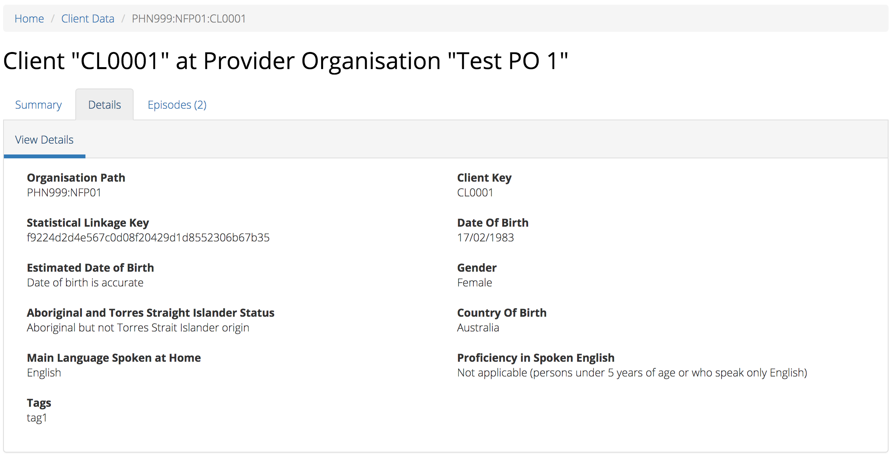

.. _edit-client:

Editing a Client
----------------

You can edit a clients's details through the :ref:`search-client`
available on the Data Entry tab, by following these steps:

1. Create :ref:`search-client`.
2. From the Client Search table, click the Client Key.
3. Click Details tab, to view Client's details.
4. Click Edit Details tab.
5. Update the Client's details. Mandatory fields are marked with an * . (Specification :ref:`Client Data Elements <client-data-elements>`)
    *Please note: You can edit the Client Key from this screen. See* :ref:`edit-client-key`.

    .. figure:: screen-shots/client-view-edit.png
       :alt: Client Data Edit Details

   *Please note: If you edit the 'Date of Birth' or 'Gender' you will be required to update the 'Statistical Linkage Key' field.*
   *You can choose to 'Enter' or 'Generate' a Client's SLK.*
   *The SLK is generated on your device, the names used are not stored or transmitted over the network.*

    .. figure:: screen-shots/client-view-generate-slk-edit.png
       :alt: Client Data Generated Client SLK Edit

6. Click the blue 'Save' button. (If you decide not to save changes, you can simply navigate away from this screen)

You will receive confirmation that the Client's details have been saved, and it
will now be displaying these new details in the Clients View Details tab.

        .. figure:: screen-shots/client-data-saved.png
           :alt: Client Data Saved Successfully

If you receive an error message, the data will need to be corrected before the
record is saved and added to the PMHC MDS.
See Validation Rules - :ref:`client-current-validations`

.. _edit-client-key:

Editing a Client Key
~~~~~~~~~~~~~~~~~~~~

You can edit a clients's identification key through :ref:`edit-client`
available on the Data Entry tab, by following these steps:

1. In step five when :ref:`edit-client`.
2. From the Client Edit Details tab, click the 'Edit Key' button.

       .. figure:: screen-shots/client-view-edit-key.png
          :alt: Client Data Edit Client Key

3. Type in the new client key and click 'Next'.
4. Double check the new key is correct and click save. (If it is incorrect, click back to re-enter the key or click the 'cross' in the top right to cancel this key change request)

You will receive confirmation that the Client's key has been saved, and the screen
will now be displaying the updated client key details in the Clients View Details tab.

       .. figure:: screen-shots/client-view-key-saved.png
          :alt: Client Key Saved Successfully

.. _add-client:

Adding a New Client
-------------------

You can add a clients through the :ref:`search-client`
available on the Data Entry tab, by following these steps:

1. Create :ref:`search-client`
2. Firstly double check the client is not already added.
3. Click the blue 'Add New Client' button.
4. Choose the Provider Organisation from the drop down list.
5. Enter the Client's details. Mandatory fields are marked with an * . (Specification :ref:`Client Data Elements <client-data-elements>`)
    *Please note: With the 'Statistical Linkage Key' field you can choose to 'Enter' or 'Generate' a Client's SLK.*
    *The SLK is generated on your device, the names used are not stored or transmitted over the network.*

    .. figure:: screen-shots/client-view-generate-slk.png
       :alt: Client Data Generate Client SLK

6. Click the blue 'Save' button. (If you decide not to add this client, you can simply navigate away from this screen)

.. figure:: screen-shots/client-view-add.png
   :alt: Client Data Add Client

You will receive confirmation that the Client has been saved, and it will
now be displaying the client's saved information in the Clients View Details tab.

        .. figure:: screen-shots/client-data-saved.png
           :alt: Client Data Saved Successfully

If you receive an error message, the data will need to be corrected before the
record is saved and added to the PMHC MDS.
See Validation Rules - :ref:`client-current-validations`

.. _delete-client:

Deleting a Client
-----------------

You can delete a client through ':ref:`view-client-details`'
available on the Data Entry tab, by following these steps:

1. :ref:`Search<find-client>` for the client.
2. From the :ref:`search-client` table, click the Client Key.
3. Click Details tab, to :ref:`view Client's details<view-client-details>`.
4. Click the red 'Delete' button.
5. You will either be displayed a ':ref:`confirm-delete-client`' screen or a ':ref:`cannot-delete-client`' screen.

.. _confirm-delete-client:

Confirm Delete
~~~~~~~~~~~~~~

**Please note: Once the client is deleted, you will not be able to recover this client data.**

1. Click the blue 'Confirm' button to delete this client. (or click the orange 'Cancel' button if you decide not to delete this client data)

  .. figure:: screen-shots/client-view-delete-confirm.png
     :alt: Client Data Confirm Delete

After you click 'Confirm', you will receive confirmation that the Client has
been deleted, and you will be redirected to the :ref:`search-client` where the
client will no longer be displayed.

    .. figure:: screen-shots/client-view-delete-successful.png
       :alt: Client Data Delete Successful

.. _cannot-delete-client:

Cannot Delete
~~~~~~~~~~~~~

If the client you are trying to delete has any dependant records, you will not
be able to proceed with deleting this client until all the related records have
been deleted.

1. You can click on the link provided to View the Client's Episodes, or click the orange 'Dismiss' button

  .. figure:: screen-shots/client-view-delete-cannot.png
     :alt: Client Data Cannot Delete

See :ref:`delete-episode`

.. _episode-data:

Episodes
^^^^^^^^

.. _view-episodes:

Viewing a Client's Episodes
---------------------------

You can view a clients's episodes through the :ref:`view-client-details`
available on the Data Entry tab, by following these steps:

1. Once :ref:`view-client-details`
2. From the Client's Summary tab, you can shortcut straight to an episode by clicking
   the Blue Episode Key displayed in the snapshot of the five most recent episodes.

3. Alternately, if you would like to view all episodes you can click on the
   Episode Tab. The heading for this tab displays in brackets the total number of episodes recorded
   in the PMHC MDS for this client at Provider Organisations for which you have access.

A table will display all the Client's Episodes at Provider Organisations for which you have access.

.. figure:: screen-shots/client-episodes-summary.png
   :alt: Client Data Summary View

A Drop down list is available to view:

* All Episodes
* Currently Open Episodes
* Closed Episodes

.. figure:: screen-shots/client-episodes-summary-sort.png
   :alt: Client Episodes Sort View

4. To view the Client's Episode details, click the Blue Episode Key.

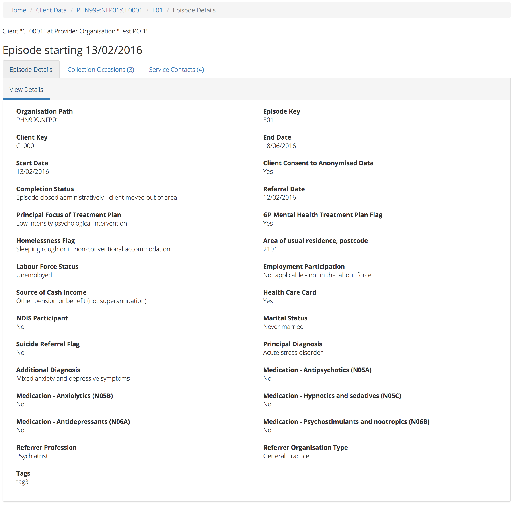

A page will display the Client's Episode details as recorded via the :ref:`Episode Data Elements <episode-data-elements>`.

.. _edit-episode:

Editing a Client's Episode data
-------------------------------

You can edit a Client's Episode details through the :ref:`view-client-details`
available on the Data Entry tab, by following these steps:

1. Once :ref:`view-episodes`.
2. From the Client's Episode table, click the Episode Key.
3. Click Edit Details tab.
4. Update the Client's Episode details. Mandatory fields are marked with an * . (Specification :ref:`Episode Data Elements <episode-data-elements>`)
    *Please note: You can edit the Episode Key from this screen. See* :ref:`edit-episode-key`.

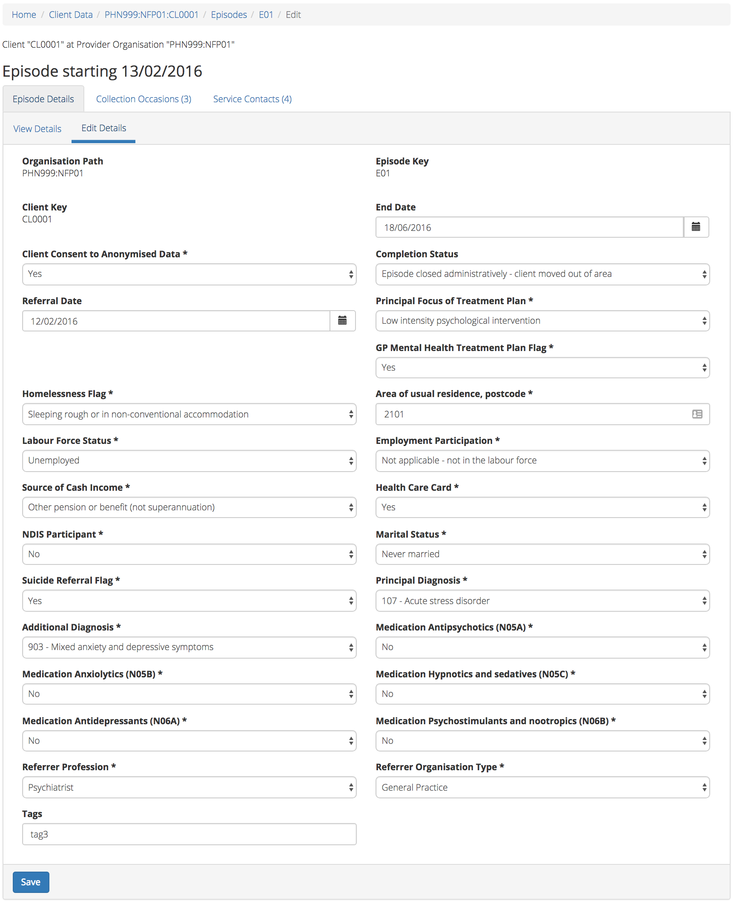

5. Click the blue 'Save' button. (If you decide not to save changes, you can simply navigate away from this screen)

You will receive confirmation that the Client's Episode details have been saved,
and it will now be displaying these new details in the Episode View Details tab.

        .. figure:: screen-shots/client-data-saved.png
           :alt: Client Episode Data Saved Successfully

If you receive an error message, the data will need to be corrected before the
record is saved and added to the PMHC MDS.
See Validation Rules - Episode :ref:`episode-current-validations`

.. _edit-episode-key:

Editing a Episode Key
~~~~~~~~~~~~~~~~~~~~~

You can edit an episode's identification key through :ref:`view-episodes`
available on the Data Entry tab, by following these steps:

1. In step five when :ref:`edit-episode`.
2. From the Episode Edit Details tab, click the 'Edit Key' button.

       .. figure:: screen-shots/client-episodes-edit-key.png
          :alt: Episode Data Edit Episode Key

3. Type in the new episode key and click 'Next'.
4. Double check the new key is correct and click save. (If it is incorrect, click back to re-enter the key or click the 'cross' in the top right to cancel this key change request)

You will receive confirmation that the Episode's key has been saved, and the screen
will now be displaying the updated episode key details in the Episodes View Details tab.

       .. figure:: screen-shots/client-episodes-edit-key-saved.png
          :alt: Episode Key Saved Successfully

.. _add-episode:

Adding a Client's Episode data
------------------------------

You can add a clients through the :ref:`view-client-details`
available on the Data Entry tab, by following these steps:

1. Once :ref:`view-episodes`.
2. Firstly double check the client does not have any open episode already showing. (A client can only have one open episode at a provider organsiation. :ref:`key-concepts-episode`)
3. Click the Add Episode tab.
4. Enter the Client's Episode details. Mandatory fields are marked with an * . (Specification :ref:`Episode Data Elements <episode-data-elements>`)

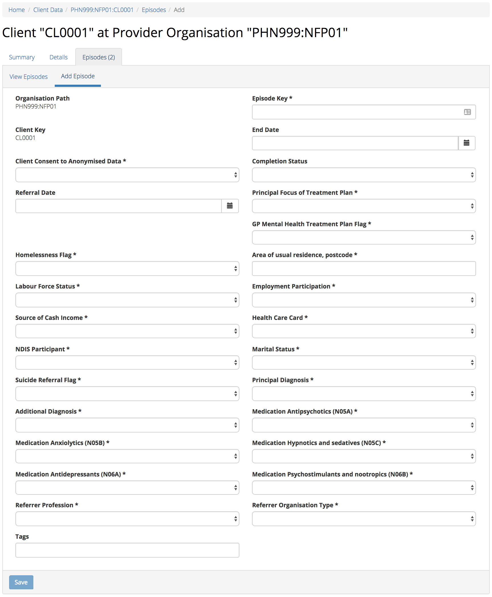

5. Click the blue 'Save' button. (If you decide not to add this client's episode, you can simply navigate away from this screen)

You will receive confirmation that the Client's Episode details have been added,
and it will now be displaying these new details in the Episode View Details tab.

        .. figure:: screen-shots/client-data-saved.png
           :alt: Client Episode Data Saved Successfully

If you receive an error message, the data will need to be corrected before the
record is saved and added to the PMHC MDS.
See Validation Rules - :ref:`episode-current-validations`

.. _delete-episode:

Deleting an Episode
-------------------

You can delete a Client's Episode through ':ref:`view-episodes`'
available on the Data Entry tab, by following these steps:

1. :ref:`Search<find-client>` for the client.
2. From the :ref:`search-client` table, click the Client Key.
3. Click Episodes tab, to :ref:`view Client's Episodes <view-episodes>`.
4. From the :ref:`View Episodes <view-episodes>` table, click the Episode Key.
5. Click the red 'Delete' button.
6. You will either be displayed a ':ref:`confirm-delete-episode`' screen or a ':ref:`cannot-delete-episode`' screen.

.. _confirm-delete-episode:

Confirm Delete
~~~~~~~~~~~~~~

**Please note: Once the episode is deleted, you will not be able to recover this episode data.**

1. Click the blue 'Confirm' button to delete this episode. (or click the orange 'Cancel' button if you decide not to delete this episode data)

  .. figure:: screen-shots/client-episodes-delete-confirm.png
     :alt: Client Episode Data Confirm Delete

After you click 'Confirm', you will receive confirmation that the episode has
been deleted, and you will be redirected to the :ref:`View Episodes <view-episodes>` where the
episode will no longer be displayed.

    .. figure:: screen-shots/client-episodes-delete-successful.png
       :alt: Client Episode Data Delete Successful

.. _cannot-delete-episode:

Cannot Delete
~~~~~~~~~~~~~

If the episode you are trying to delete has any dependant records, you will not
be able to proceed with deleting this episode until all the related records have
been deleted.

1. You can click on the link provided to View the Client's Service Contacts and collection Occasions, or click the orange 'Dismiss' button

  .. figure:: screen-shots/client-episodes-delete-cannot.png
     :alt: Client Episode Data Cannot Delete

See :ref:`delete-service-contact` and :ref:`delete-collection-occasion`

.. _service-contact-data:

Service Contacts
^^^^^^^^^^^^^^^^

.. _view-service-contact:

Viewing a Client's Service Contacts for an Episode
--------------------------------------------------

You can view a client's service contacts through the :ref:`view-episodes`
available on the Data Entry tab, by following these steps:

1. Once :ref:`view-episodes`
2. From the Client's Episode Details tab, click the Service Contacts Tab.
   The heading for this tab displays in brackets the total number of service contacts recorded
   in the PMHC MDS for this episode.

A table will display all the Service Contacts linked to this Client's Episode.

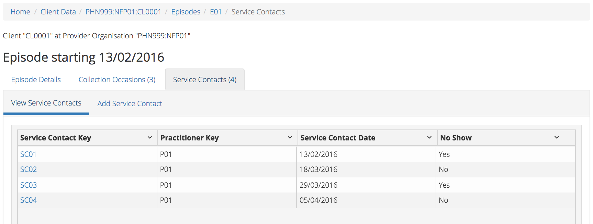

3. To view the Service Contacts details, click the Blue Service Contact Key.

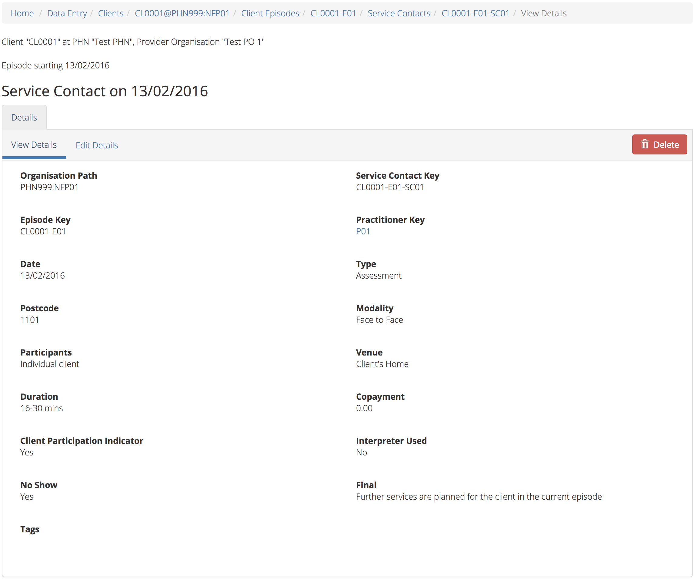

A page will display the Service Contacts details as recorded via the :ref:`Service Contact Data Elements <service-contact-data-elements>`.

.. _edit-service-contact:

Editing a Client's Service Contacts for an Episode
--------------------------------------------------

You can edit a client's service contacts through the :ref:`view-episodes`
available on the Data Entry tab, by following these steps:

1. Once :ref:`view-service-contact`.
2. From the Service Contacts table, click the Service Contact Key.
3. Click Edit Service Contact tab.
4. Update the Client's Service Contact details for that service-contact. Mandatory fields are marked with an * . (Specification :ref:`Service Contact Data Elements <service-contact-data-elements>`)
    *Please note: You can edit the Service Contact Key from this screen. See* :ref:`edit-service-contact-key`.

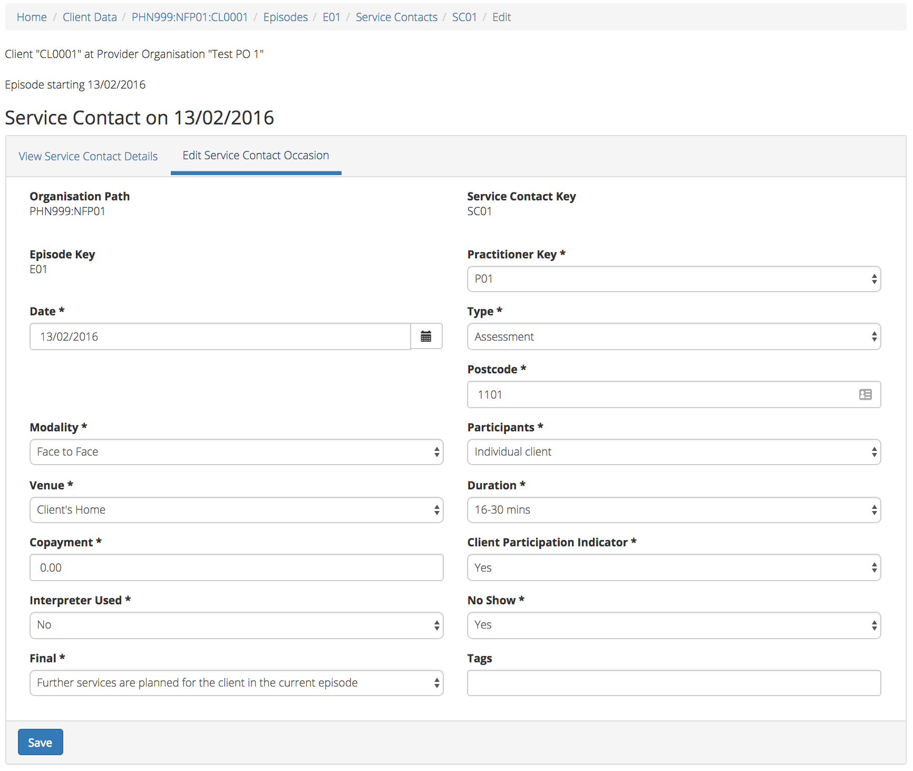

5. Click the blue 'Save' button. (If you decide not to save changes, you can simply navigate away from this screen)

You will receive confirmation that the Client's service contact details have been saved,
and it will now be displaying these new details in the View service Contact Details tab.

        .. figure:: screen-shots/client-data-saved.png
           :alt: Client Data Saved Successfully

If you receive an error message, the data will need to be corrected before the
record is saved and added to the PMHC MDS.
See Validation Rules - :ref:`service-contact-current-validations`

.. _edit-service-contact-key:

Editing a Service Contact Key
~~~~~~~~~~~~~~~~~~~~~~~~~~~~~

You can edit an service contact's identification key through :ref:`view-episodes`
available on the Data Entry tab, by following these steps:

1. In step five when :ref:`edit-service-contact`.
2. From the Service Contact Edit Details tab, click the 'Edit Key' button.

       .. figure:: screen-shots/client-service-contacts-edit-key.png
          :alt: Client Data Edit Service Contact Key

3. Type in the new service contact key and click 'Next'.
4. Double check the new key is correct and click save. (If it is incorrect, click back to re-enter the key or click the 'cross' in the top right to cancel this key change request)

You will receive confirmation that the Service Contact's key has been saved, and the screen
will now be displaying the updated service contact key details in the Service Contacts View Details tab.

       .. figure:: screen-shots/client-service-contacts-edit-key-saved.png
          :alt: Service Contact Key Saved Successfully

.. _add-service-contact:

Adding a Client's Service Contact data
--------------------------------------

You can add a client's service contacts through the :ref:`view-episodes`
available on the Data Entry tab, by following these steps:

1. Once :ref:`view-service-contact`.
2. Firstly double check the service contact is not already showing.
3. Click the Add Service Contact tab.
4. Enter the Client's Service Contact details for that episode. Mandatory fields are marked with an * . (Specification :ref:`Service Contact Data Elements <service-contact-data-elements>`)

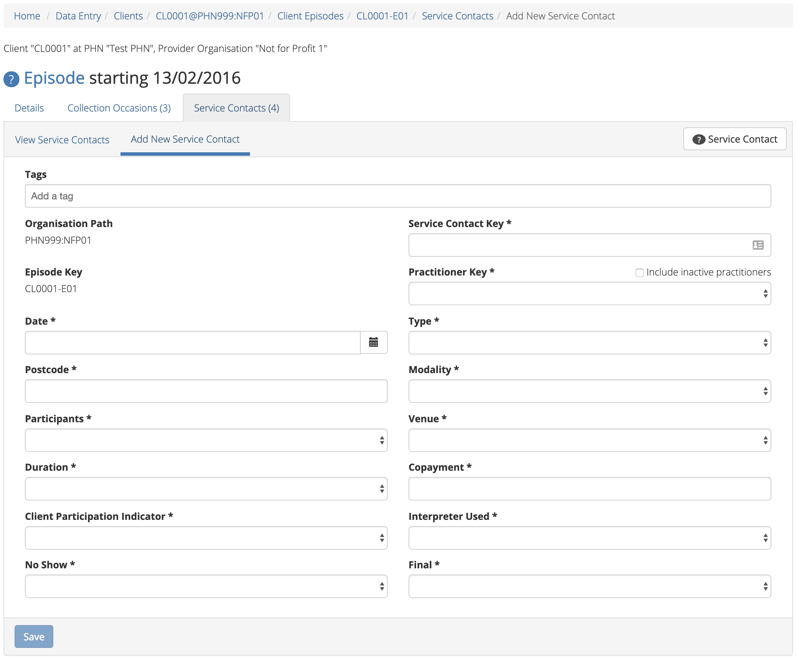

5. Click the blue 'Save' button. (If you decide not to add this client's episode, you can simply navigate away from this screen)

You will receive confirmation that the Client's service contact details have been added,
and it will now be displaying these new details in the View service Contact Details tab.

        .. figure:: screen-shots/client-data-saved.png
           :alt: Client Data Saved Successfully

If you receive an error message, the data will need to be corrected before the
record is saved and added to the PMHC MDS.
See Validation Rules - :ref:`service-contact-current-validations`

.. _delete-service-contact:

Deleting an Service Contact
---------------------------

You can delete a client's service contacts through ':ref:`view-service-contact`'
available on the Data Entry tab, by following these steps:

1. :ref:`Search<find-client>` for the client.
2. From the :ref:`search-client` table, click the Client Key.
3. Click Episodes tab, to :ref:`view Client's Episodes <view-episodes>`.
4. From the :ref:`View Episodes <view-episodes>` table, click the Episode Key.
5. Click Service Contacts tab, to :ref:`View Client's Service Contacts <view-service-contact>`.
6. From the :ref:`View service contact <view-service-contact>` table, click the Service Contact Key.
7. Click the red 'Delete' button.
8. You will be displayed a 'Confirm Deletion' screen.

  **Please note: Once the service contact is deleted, you will not be able to recover this service contact data.**

9. Click the blue 'Confirm' button to delete this service contact. (or click the orange 'Cancel' button if you decide not to delete this service contact data)

  .. figure:: screen-shots/client-service-contacts-delete-confirm.png
     :alt: Client Service Contact Data Confirm Delete

After you click 'Confirm', you will receive confirmation that the service contact has
been deleted, and you will be redirected to the :ref:`View Service Contacts <view-service-contact>` where the
service contact will no longer be displayed.

    .. figure:: screen-shots/client-service-contacts-delete-successful.png
       :alt: Client Service Contact Data Delete Successful

.. _outcome-collection-occasion-data:

Outcome Collection Occasions
^^^^^^^^^^^^^^^^^^^^^^^^^^^^

.. _view-collection-occasion:

Viewing a Client's Outcome Collection Occasions for an Episode
--------------------------------------------------------------

You can view a clients's outcome collection occasions through :ref:`view-episodes`
available on the Data Entry tab, by following these steps:

1. Once :ref:`Viewing the Client's Episode <view-episodes>`.
2. Click the Episode Collection Occasions Tab.
   This tab displays in brackets the total number of collection occasions recorded
   in the PMHC MDS for this episode.

A table will display all the Collection Occasions linked to this Client's Episode.

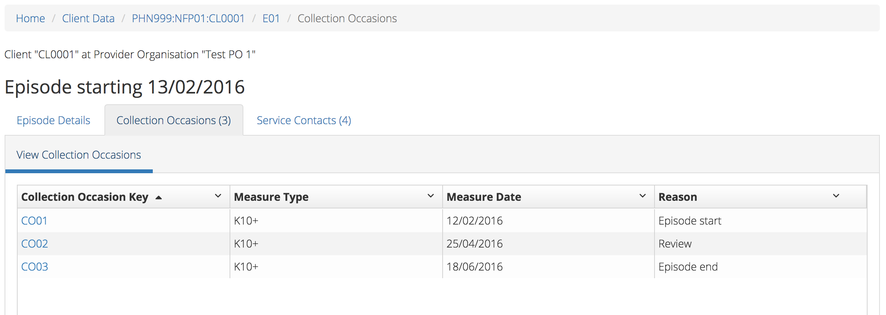

3. To view the Collection Occasions details, click the Blue Collection Occasions Key.

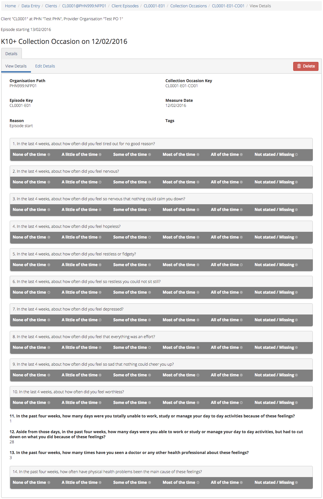

A page will display the Collection Occasions details as recorded via the
:ref:`Outcome Collection Occasion Data Elements <outcome-collection-occasion-data-elements>`.

.. _edit-collection-occasion:

Editing a Client's Outcome Collection Occasions for an Episode
--------------------------------------------------------------

You can edit a client's Outcome Collection Occasions through :ref:`view-collection-occasion`
available on the Data Entry tab, by following these steps:

1. Once :ref:`view-collection-occasion`.
2. Click the Collection Occasions Key.
3. Click Edit Details tab.
4. Update the Client's Collection Occasions details. Mandatory fields are marked with an * .(Specification :ref:`Collection Occasions Data Elements <outcome-collection-occasion-data-elements>`)
    *Please note: You can edit the Collection Occasion Key from this screen. See* :ref:`edit-collection-occasion-key`.

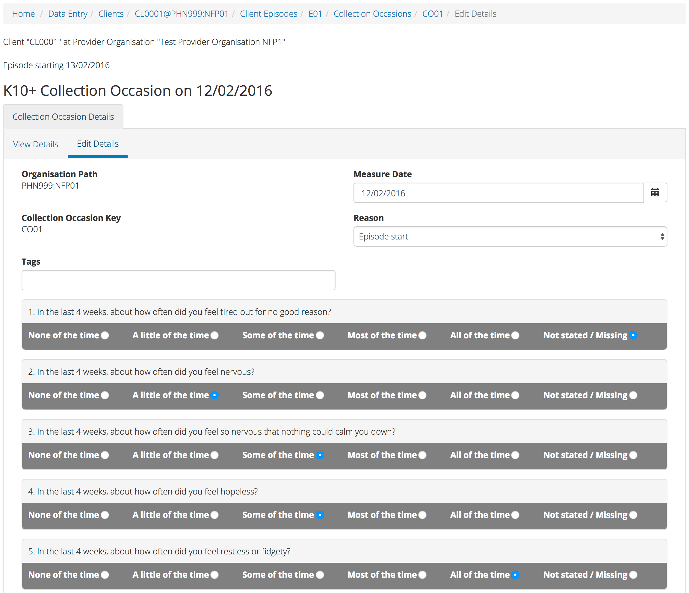

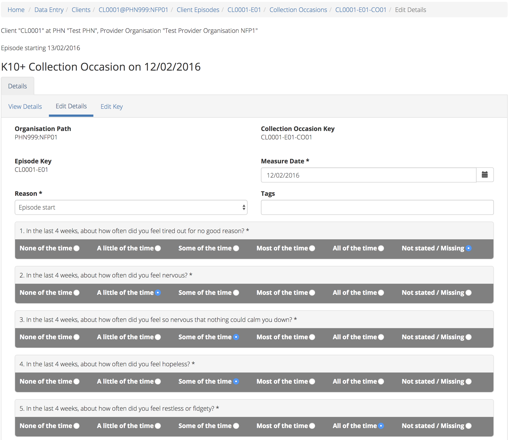

5. Click the blue 'Save' button. (If you decide not to save changes, you can simply navigate away from this screen)

You will receive confirmation that the Client's Collection Occasions details have been saved,
and it will now be displaying these new details in the View Collection Occasions Details tab.

        .. figure:: screen-shots/client-data-saved.png
           :alt: Client Data Saved Successfully

If you receive an error message, the data will need to be corrected before the
record is saved and added to the PMHC MDS.
See Validation Rules for:
* :ref:`k10p-current-validations`
* :ref:`k5-current-validations`
* :ref:`sdq-current-validations`

.. _edit-collection-occasion-key:

Editing a Collection Occasion Key
~~~~~~~~~~~~~~~~~~~~~~~~~~~~~~~~~

You can edit an collection occasion's identification key through :ref:`view-episodes`
available on the Data Entry tab, by following these steps:

1. In step five when :ref:`edit-collection-occasion`.
2. From the Collection Occasion Edit Details tab, click the 'Edit Key' button.

       .. figure:: screen-shots/client-collection-occasions-edit-key.png
          :alt: Client Data Edit Collection Occasion Key

3. Type in the new collection occasion key and click 'Next'.
4. Double check the new key is correct and click save. (If it is incorrect, click back to re-enter the key or click the 'cross' in the top right to cancel this key change request)

You will receive confirmation that the Collection Occasion's key has been saved, and the screen
will now be displaying the updated collection occasion key details in the Collection Occasions View Details tab.

       .. figure:: screen-shots/client-collection-occasions-edit-key-saved.png
          :alt: Collection Occasion Key Saved Successfully

.. _add-collection-occasion:

Adding a Client's Outcome Collection Occasions data
---------------------------------------------------

You can add a Client's Outcome Collection Occasions through :ref:`view-collection-occasion`
available on the Data Entry tab, by following these steps:

1. Once :ref:`view-collection-occasion`.
2. Firstly double check the Collection Occasions is not already showing.
3. Click the Add New Collection Occasion tab.
4. Select the Collection Occassion Measure, either K10+, K5 or SDQ. (The SDQ items scored will be added in the near future. See Development Release Schedule :ref:`dev-data-entry-faq`)

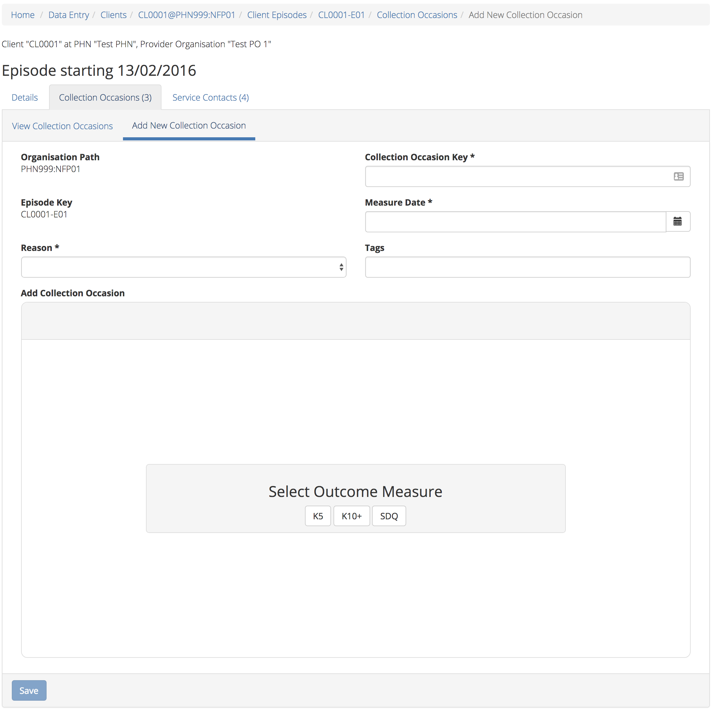

5. Select to enter the item scores or the total score. (Individual item scores will eventually be required and should be entered when available)
    *Please note: The SDQ items scored will be added in the near future. See Development Release Schedule* :ref:`dev-data-entry-faq`.

.. figure:: screen-shots/client-collection-occasions-score.png
   :alt: Client Data Add Collection Occasions

6. Enter the Client's Collection Occasions details for that episode. Mandatory fields are marked with an * . (Specification :ref:`Collection Occasions Data Elements <outcome-collection-occasion-data-elements>`)

.. figure:: screen-shots/client-collection-occasions-add.png
   :alt: Client Data Add Collection Occasions

7. Click the blue 'Save' button. (If you decide not to add this client's episode, you can simply navigate away from this screen)

You will receive confirmation that the Client's Collection Occasions details have been added,
and it will now be displaying these new details in the View Collection Occasions Details tab.

        .. figure:: screen-shots/client-data-saved.png
           :alt: Client Data Saved Successfully

If you receive an error message, the data will need to be corrected before the
record is saved and added to the PMHC MDS.
See Validation Rules for:
* :ref:`k10p-current-validations`
* :ref:`k5-current-validations`
* :ref:`sdq-current-validations`

.. _delete-collection-occasion:

Deleting an Outcome Collection Occasions
----------------------------------------

You can delete a Client's Outcome Collection Occasion through ':ref:`view-collection-occasion`'
available on the Data Entry tab, by following these steps:

1. :ref:`Search<find-client>` for the client.
2. From the :ref:`search-client` table, click the Client Key.
3. Click Episodes tab, to :ref:`view Client's Episodes <view-episodes>`.
4. From the :ref:`View Episodes <view-episodes>` table, click the Episode Key.
5. Click Collection Occasions tab, to :ref:`View Collection Occasions <view-collection-occasion>`.
6. From the :ref:`View Collection Occasions <view-collection-occasion>` table, click the Collection Occasions Key.
7. Click the red 'Delete' button.
8. You will be displayed a 'Confirm Deletion' screen.

  **Please note: Once the collection occasion is deleted, you will not be able to recover this collection occasion data.**

9. Click the blue 'Confirm' button to delete this collection occasion. (or click the orange 'Cancel' button if you decide not to delete this collection occasion data)

  .. figure:: screen-shots/client-collection-occasions-delete-confirm.png
     :alt: Client Collection Occasion Data Confirm Delete

After you click 'Confirm', you will receive confirmation that the collection occasion has
been deleted, and you will be redirected to the :ref:`View Collection Occasions <view-collection-occasion>` where the
collection occasion will no longer be displayed.

    .. figure:: screen-shots/client-collection-occasions-delete-successful.png
       :alt: Client Collection Occasion Data Delete Successful

.. _practitioner:

Practitioners
^^^^^^^^^^^^^

.. _find-practitioner:

Finding a Practitioner
----------------------

You can search for practitioners assigned to an organisation through the
Data Entry tab, by following these steps:

1. Click on the Practitioners tab.

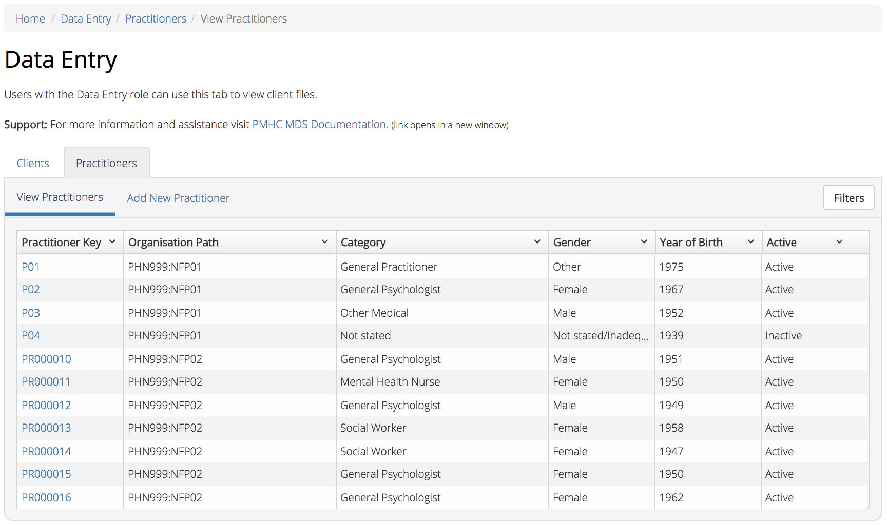

.. _view-practitioner:

Viewing a Practitioner
----------------------

You can view a practitioner's details through :ref:`find-practitioner`
on the Data Entry tab, by following these steps:

1. Click on the :ref:`Practitioners <find-practitioner>` tab.
2. Click on the practitioner's key in blue displayed within the table list.

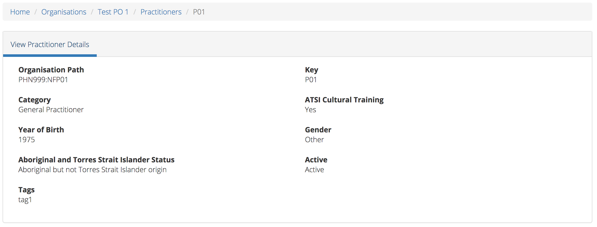

Please note: You can also view a practitioner's details through the 'Client Data' tab.
See :ref:`view-practitioner-details`

.. _view-practitioner-details:

Viewing a Practitioner Providing Client Services
------------------------------------------------

You can view a practitioner's details through :ref:`view-service-contact`
on the Data Entry tab, by following these steps:

1. Click on the :ref:`Practitioners <find-practitioner>` tab.
2. From the Outcome Collection Occasions Details tab, click the Practitioner Key.

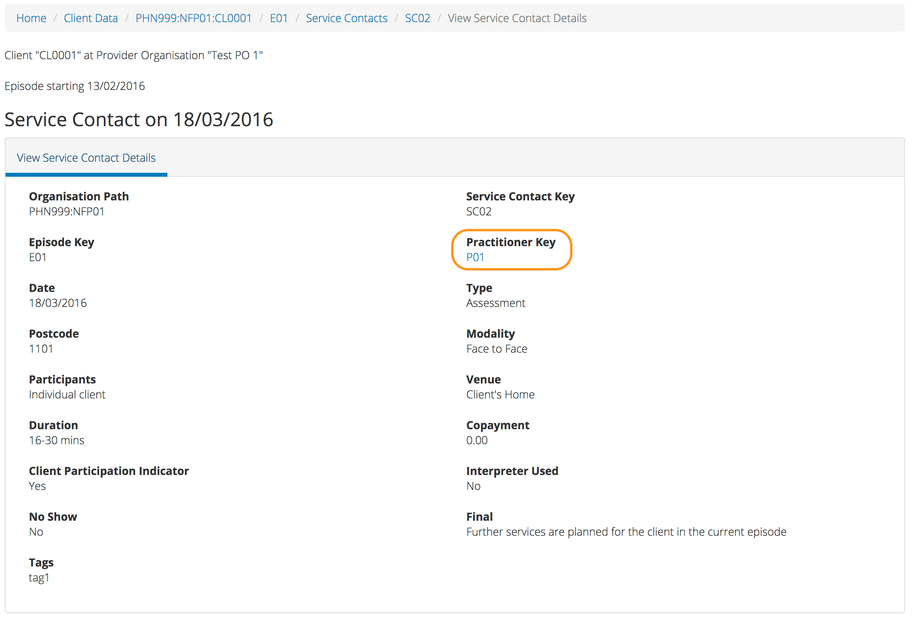

A page will display the Practitioner's details as recorded via the :ref:`Practitioner Data Elements <practitioner-data-elements>`.

.. _edit-practitioner:

Editing a Practitioner
----------------------

You can view a practitioner's details through :ref:`find-practitioner`
on the Data Entry tab, by following these steps:

1. Click on the :ref:`Practitioners <find-practitioner>` tab.
2. Click on the practitioner's key in blue displayed within the table list.
3. From the View Practitioner Details tab, click the Edit Details tab.
4. Update the practitioner's details. Mandatory fields are marked with an * .
    *Please note: You can edit the Practitioner Key from this screen. See* :ref:`edit-practitioner-key`.

.. figure:: screen-shots/practitioner-view-edit.png
   :alt: PMHC MDS Practitioner Details View

5. Click the blue 'Save' button. (If you decide not to save changes, you can simply navigate away from this screen)

You will receive confirmation that the practitioner's details have been added,
and it will now be displaying these new details in the View Practitioner Details tab.

        .. figure:: screen-shots/client-data-saved.png
           :alt: Client Data Saved Successfully

If you receive an error message, the data will need to be corrected before the
record is saved and added to the PMHC MDS.
See Validation Rules - :ref:`practitioner-current-validations`

.. _edit-practitioner-key:

Editing a Practitioner Key
~~~~~~~~~~~~~~~~~~~~~~~~~~

You can edit a practitioners's identification key through :ref:`edit-practitioner`
available on the Data Entry tab, by following these steps:

1. In step five when :ref:`edit-practitioner`.
2. From the Practitioner Edit Details tab, click the 'Edit Key' button.

       .. figure:: screen-shots/practitioner-view-edit-key.png
          :alt: Practitioner Data Edit Practitioner Key

3. Type in the new practitioner key and click 'Next'.
4. Double check the new key is correct and click save. If it is incorrect, click back to re-enter the key or click the 'cross' in the top right to cancel this key change request.

You will receive confirmation that the Practitioner's key has been saved, and the screen
will now be displaying the updated practitioner key details in the Practitioners View Details tab.

       .. figure:: screen-shots/practitioner-view-key-saved.png
          :alt: Practitioner Key Saved Successfully

.. _add-practitioner:

Adding a Practitioner
----------------------

You can view a practitioner's details through :ref:`find-practitioner`
on the Data Entry tab, by following these steps:

1. Click on the :ref:`Practitioners <find-practitioner>` tab.
2. Click the Add New Practitioner tab.
3. Enter the practitioner's details. Mandatory fields are marked with an * .

.. figure:: screen-shots/practitioner-add-view.png
   :alt: PMHC MDS Practitioner Details View

4. Click the blue 'Save' button.  (If you decide not to save changes, you can simply navigate away from this screen)

You will receive confirmation that the practitioner's details have been added,
and it will now be displaying these new details in the View Practitioner Details tab.

        .. figure:: screen-shots/client-data-saved.png
           :alt: Client Data Saved Successfully

If you receive an error message, the data will need to be corrected before the
record is saved and added to the PMHC MDS.
See Validation Rules - :ref:`practitioner-current-validations`

You can add a practitioners individually through the data entry interface or
alternately, practitioner records can be uploaded in bulk. See :ref:`upload`

.. _delete-practitioner:

Deleting a Practitioner
-----------------------

You can delete a practitioner's details through :ref:`edit-practitioner`
on the Data Entry tab, by following these steps:

1. Click on the :ref:`Practitioners <find-practitioner>` tab.
2. Click on the practitioner's key in blue displayed within the table list.
3. Click the red 'Delete' button.
4. You will either be displayed a ':ref:`confirm-delete-practitioner`' screen or a ':ref:`cannot-delete-practitioner`' screen.

.. _confirm-delete-practitioner:

Confirm Delete
~~~~~~~~~~~~~~

**Please note: Once the practitioner is deleted, you will not be able to recover this practitioner data.**

1. Click the blue 'Confirm' button to delete this practitioner. (or click the orange 'Cancel' button if you decide not to delete this practitioner data)

  .. figure:: screen-shots/practitioner-delete-confirm.png
     :alt: Practitioner Data Confirm Delete

After you click 'Confirm', you will receive confirmation that the practitioner has
been deleted, and you will be redirected to the :ref:`View Practitioners<view-practitioner>` where the
practitioner will no longer be displayed.

    .. figure:: screen-shots/practitioner-delete-successful.png
       :alt: Practitioner Data Delete Successful

.. _cannot-delete-practitioner:

Cannot Delete
~~~~~~~~~~~~~

If the practitioner you are trying to delete has any dependant records, you will not
be able to proceed with deleting this practitioner until all the related records have
been edited or deleted.

1. You can click the orange 'Dismiss' button.

  .. figure:: screen-shots/practitioner-delete-cannot.png
     :alt: Client Episode Data Cannot Delete

See :ref:`edit-service-contact` or :ref:`delete-service-contact`.

.. _inactive-practitioner:

Inactive Practitioners
----------------------

Currently a practitioner can not be deleted from the PMHC MDS if they have any dependant records,.

You can change the practitioner from 'active' to 'inactive' by editing their details.
By doing this, the inactive practitioner keys will no longer be displayed in the
Practitioner Key drop down list displayed on the Service Contact forms.

See :ref:`edit-practitioner`.
