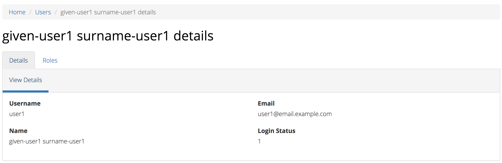

Organisations
=============

You will only be able to see the Organisations tab if you have been assigned
the 'Organisation Management' or the 'User Management' role.

If you believe you should have access to an organisation and it doesn't appear
in your list please contact someone in that provider organisation or the
provider organisation's PHN who has the 'User Management' role.

If you are unsure who has the 'User Management' role please email the PMHC
helpdesk at support@pmhc-mds.com

After navigating to the organisation tab, you will be presented with a list of
top level organisations for which you have been assigned the 'Organisation Management'
or the 'User Management' role.

.. figure:: screen-shots/organisations.png
   :alt: PMHC MDS Organisations

.. _view_organisation:

Searching for an Subrganisation
^^^^^^^^^^^^^^^^^^^^^^^^^^^^^

You can sort and filter the listed PHNs and suborganisations through the organisation tab.

Sort the listed PHNs and suborganisations by simply clicking on a column header
of their relevant tables. Alternately you can click on the arrow beside a
column header for more sort options, as follows:

- Sort Ascending
- Sort Descending
- Remove Sort
- Hide Column

To filter the listed organisations:

1. Click the grey 'Filters' button.
2. Start typing in an edit box now displayed under the column headers.

.. figure:: screen-shots/organisations-filter.png
   :alt: PMHC MDS Organisations Filter

3. To remove the filter, click the grey cross within the edit box beside any
   entered text.

.. _view_phn:

Viewing a PHN
^^^^^^^^^^^^^

You can view an PHN organisation's details through the organisation tab, by
following these steps:

1. Navigate to the Organisations tab.

.. figure:: screen-shots/organisations.png
   :alt: PMHC MDS Organisations

2. Click on the PHN name in blue text displayed within the table list.

The PHN organisations details will be displayed, along with a suborganisation tab.
If you have the 'User Management' role will also include a 'Users' tab listing
the users that belong to this PHN.

.. figure:: screen-shots/view-organisation.png
   :alt: PMHC MDS View Organisation

.. _view_suborganisation:

Viewing a Suborganisation
^^^^^^^^^^^^^^^^^^^^^^^^^

You can view an organisation's details through the organisation tab, by
following these steps:

1. Navigate to the Organisations tab.

.. figure:: screen-shots/suborganisations.png
   :alt: PMHC MDS Organisations

2. Click on the PHN name in blue text displayed within the table list.
3. Click on the 'Suborganisation' tab.

The PHN's Suborganisations details will be displayed in a table..

.. _add_suborganisation:

Adding a Suborganisation
^^^^^^^^^^^^^^^^^^^^^^

If you have the 'Organisation Management' role you can add provider organisations
through the organisation tab by following these steps:

1. Navigate to the Organisations tab.

   .. figure:: screen-shots/organisations.png
      :alt: PMHC MDS Organisations

2. Click on the PHN name in blue text displayed within the table list.
3. Click on the 'Suborganisation' tab.
4. Click the 'Add Suborganisation' tab.

   .. figure:: screen-shots/add-suborganisation.png
      :alt: PMHC MDS Add Subrganisation

5. Complete all the mandatory fields marked with an * in the add suborganisation
   organisation' form.
6. Click the blue 'Save' button.

You will receive confirmation that the organisation has been saved, and it will
now be displaying in the suborganisations organisations list.

.. figure:: screen-shots/suborganisation-added.png
   :alt: PMHC MDS Organisation Added

.. _edit_suborganisation:

Editing a Suborganisation
^^^^^^^^^^^^^^^^^^^^^^^

If you have the 'Organisation Management' role you can edit a suborganisation's
details through the organisation tab, by following these steps:

1. Navigate to the Organisations tab.

.. figure:: screen-shots/organisations.png
   :alt: PMHC MDS Organisations

2. Click on the PHN name in blue text displayed within the table list.

   .. figure:: screen-shots/view-organisation.png
      :alt: PMHC MDS View PHN

3. Click on the 'Suborganisation' tab.
4. Click on the Suborganisation name in blue text displayed within the
   suborganisations table.

   .. figure:: screen-shots/view-suborganisation.png
      :alt: PMHC MDS View Provider Organisation

3. If you have permission to edit the Suborganisation an'Edit Details' tab will
   be displayed.
4. Click the blue 'Edit' button.

   .. figure:: screen-shots/edit-suborganisation.png
      :alt: PMHC MDS Edit Organisation

4. Update the organisations details. Mandatory fields are marked with an *
5. Click the blue 'Save' button.

.. _delete_organisation:

Inactive Organisation
^^^^^^^^^^^^^^^^^^^^^

You can make a suborganisation inactive by editing the 'Status' of an suborganisation
from active to inactive. See :ref:`edit_suborganisation`

*Please note: Inactive organisations will still be displayed in your organisations list.*

Deleting an Organisation
^^^^^^^^^^^^^^^^^^^^^^^^

You cannot delete an Organisation. If you believe an organisation should be
deleted please email support@pmhc-mds.com.

Viewing Organisational Users
^^^^^^^^^^^^^^^^^^^^^^^^^^^^

You can view users assigned to an organisation through the organisation tab
if you have been assigned the 'User Management' role, by following these steps:

1. Navigate to the PHNs details or Suborganisations tab.

.. figure:: screen-shots/organisations.png
   :alt: PMHC MDS Organisations

2. Click on the PHNs or suborganisation name in blue displayed within the table list.
   If you are unsure how to view the details see :ref:`view_PHN` or :ref:`view_suborganisation`
3. Under the 'Users' tab, you can view a table list of the
   organisation's users.
4. You can filter the users within this table list,
   click the grey 'Filters' button and start typing in an edit box now
   displayed under the column headers. To remove the filter, click the grey
   cross within the edit box beside any entered text.

.. figure:: screen-shots/user-roles-at-organisation.png
   :alt: PMHC MDS User Roles at Organisation

.. _adding_roles:

Assigning Extra Roles to an Organisational User
^^^^^^^^^^^^^^^^^^^^^^^^^^^^^^^^^^^^^^^^^^^^^^^

You can assign extra roles to an existing organisational user by following
these steps:

1. Navigate to the organisation users tab at which you wish to add the role.
2. Click the users name
3. Follow from Step 3 at :ref:`edit_role`.
