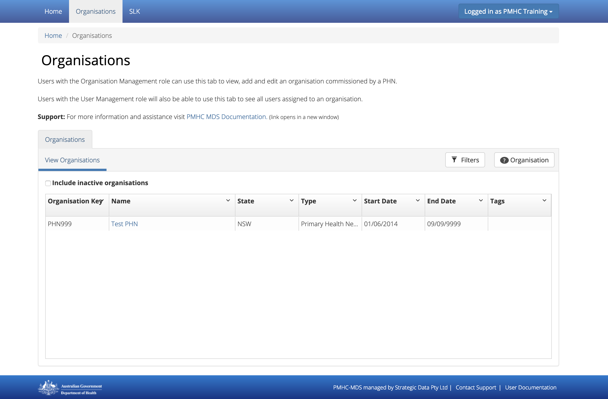
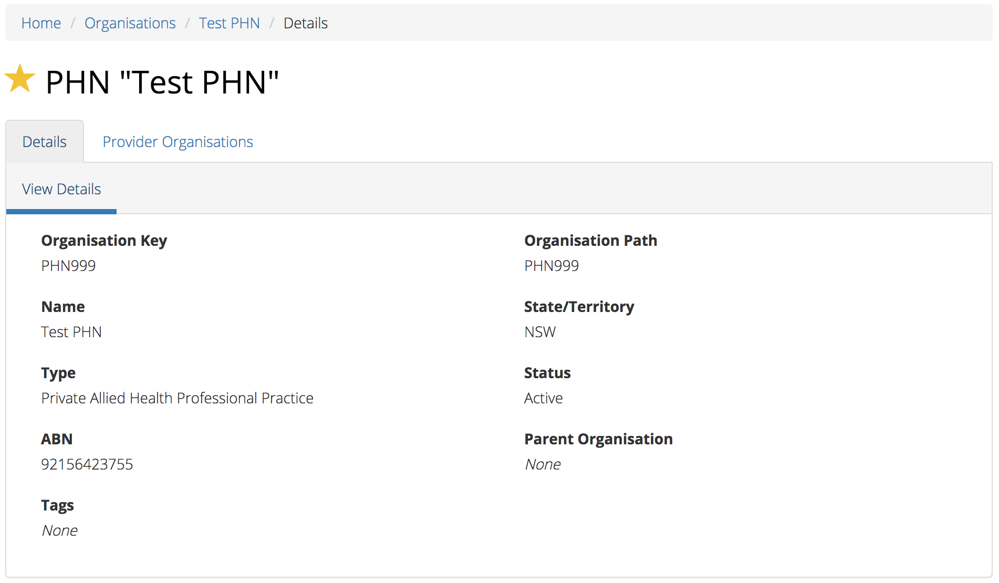
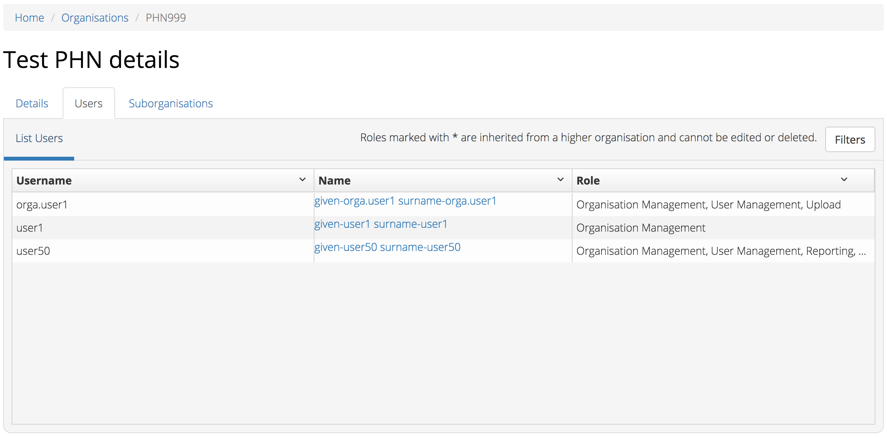

Organisations
=============

You will only be able to see the Organisations tab if you have been assigned
the 'Organisation Management' or the 'User Management' role.

If you believe you should have access to an organisation and it doesn't appear
in your list please contact someone in that provider organisation or the
provider organisation's PHN who has the 'User Management' role.

If you are unsure who has the 'User Management' role please email the PMHC
helpdesk at support@pmhc-mds.com

After navigating to the organisation tab, you will be presented with a list of
top level organisations for which you have been assigned the 'Organisation Management'
or the 'User Management' role.

.. _view-phn:

Viewing a PHN
^^^^^^^^^^^^^

You can view a PHN organisation's details through the Organisations tab, by
following these steps:

1. Navigate to the Organisations tab.
2. Click on the PHN name in blue text displayed within the table list.

The PHN organisations details will be displayed, along with a provider organisations tab.
If you have the 'User Management' role will also include a 'Users' tab listing
the users that belong to this PHN.

.. _search-provider-organisation:

Searching for a Provider Organisation
^^^^^^^^^^^^^^^^^^^^^^^^^^^^^^^^^^^^^

You can search for a provider organisation by sorting and filtering
the provider organisations of a PHN. Follow these steps:

1. Navigate to the Organisations tab.
2. Click on the PHN name in blue text displayed within the table list.
3. Click on the 'Provider Organisations' tab.
4. Sort the listed provider organisations by simply clicking on a column header
   of the provider organisations table. Alternately you can click on the arrow beside a
   column header for more sort options, as follows:

   - Sort Ascending
   - Sort Descending
   - Remove Sort
   - Hide Column

To filter the listed provider organisations:

1. Click the grey 'Filters' button.
2. Start typing in an edit box now displayed under the column headers.

.. figure:: screen-shots/organisations-filter.png
   :alt: PMHC MDS Organisations Filter

3. To remove the filter, click the grey cross within the edit box beside any
   entered text.

.. _view-provider-organisation:

Viewing a Provider Organisation
^^^^^^^^^^^^^^^^^^^^^^^^^^^^^^^

You can view a provider organisation's details through the Organisations tab, by
following these steps:

1. Navigate to the Organisations tab.
2. Click on the PHN name in blue text displayed within the table list.
3. Click on the 'Provider Organisations' tab.

The PHN's provider organisations details will be displayed in a table.

.. figure:: screen-shots/view-provider-organisation.png
   :alt: PMHC MDS View Organisation

.. _add-provider-organisation:

Adding a Provider Organisation
^^^^^^^^^^^^^^^^^^^^^^^^^^^^^^

If you have the 'Organisation Management' role you can add provider organisations
through the organisation tab by following these steps:

1. Navigate to the Organisations tab.
2. Click on the PHN name in blue text displayed within the table list.
3. Click on the 'Provider Organisations' tab.
4. Click the 'Add Provider Organisation' tab.

   .. figure:: screen-shots/add-provider-organisation.png
      :alt: PMHC MDS Add Provider Organisation

5. Complete all the mandatory fields marked with an * in the add Provider Organisation
   form.
6. Click the blue 'Save' button.

You will receive confirmation that the organisation has been saved, and it will
now be displaying in the PHN's Provider Organisations list.

.. _edit-provider-organisation:

Editing a Provider Organisation
^^^^^^^^^^^^^^^^^^^^^^^^^^^^^^^

If you have the 'Organisation Management' role you can edit a Provider Organisation's
details through the organisation tab, by following these steps:

1. Navigate to the Organisations tab.
2. Click on the PHN name in blue text displayed within the table list.

   .. figure:: screen-shots/view-organisation.png
      :alt: PMHC MDS View PHN

3. Click on the 'Provider Organisation' tab.
4. Click on the Provider Organisation name in blue text displayed within the
   Provider Organisations table.

   .. figure:: screen-shots/view-provider-organisation.png
      :alt: PMHC MDS View Provider Organisation

3. If you have permission to edit the Provider Organisation an'Edit Details' tab will
   be displayed.
4. Click the blue 'Edit' button.

   .. figure:: screen-shots/edit-provider-organisation.png
      :alt: PMHC MDS Edit Organisation

4. Update the organisations details. Mandatory fields are marked with an *
5. Click the blue 'Save' button.

.. _inactivate-provider-organisation:

Inactivate a Provider Organisation
^^^^^^^^^^^^^^^^^^^^^^^^^^^^^^^^^^

You can make a provider organisation inactive by editing the 'Status' of the
provider organisation from active to inactive. See :ref:`edit-provider-organisation`

*Please note: Inactive organisations will still be displayed in your organisations list.*

.. _delete-provider-organisation:

Deleting a Provider Organisation
^^^^^^^^^^^^^^^^^^^^^^^^^^^^^^^^

You cannot delete a provider organisation. If you believe an organisation should be
deleted please email support@pmhc-mds.com.

.. _viewing-organisational-users:

Viewing Organisational Users
^^^^^^^^^^^^^^^^^^^^^^^^^^^^

You can view users assigned to an organisation through the organisation tab
if you have been assigned the 'User Management' role, by following these steps:

1. Navigate to the tab showing either the PHNs details or the provider organisations details.
2. Click on the PHNs or provider organisations name in blue displayed within the table list.
   If you are unsure how to view the details see :ref:`view-PHN` or :ref:`view-provider-organisation`
3. Under the 'Users' tab, you can view a table list of the
   organisation's users.
4. You can filter the users within this table list,
   click the grey 'Filters' button and start typing in an edit box now
   displayed under the column headers. To remove the filter, click the grey
   cross within the edit box beside any entered text.

.. _adding-roles:

Assigning Extra Roles to an Organisational User
^^^^^^^^^^^^^^^^^^^^^^^^^^^^^^^^^^^^^^^^^^^^^^^

You can assign extra roles to an existing organisational user by following
these steps:

1. Navigate to the Organisation or Provider Organisation at which you wish to add the role.
2. Click on the Users tab
3. Click the users name
4. Follow on from Step 3 at :ref:`edit-role`.
