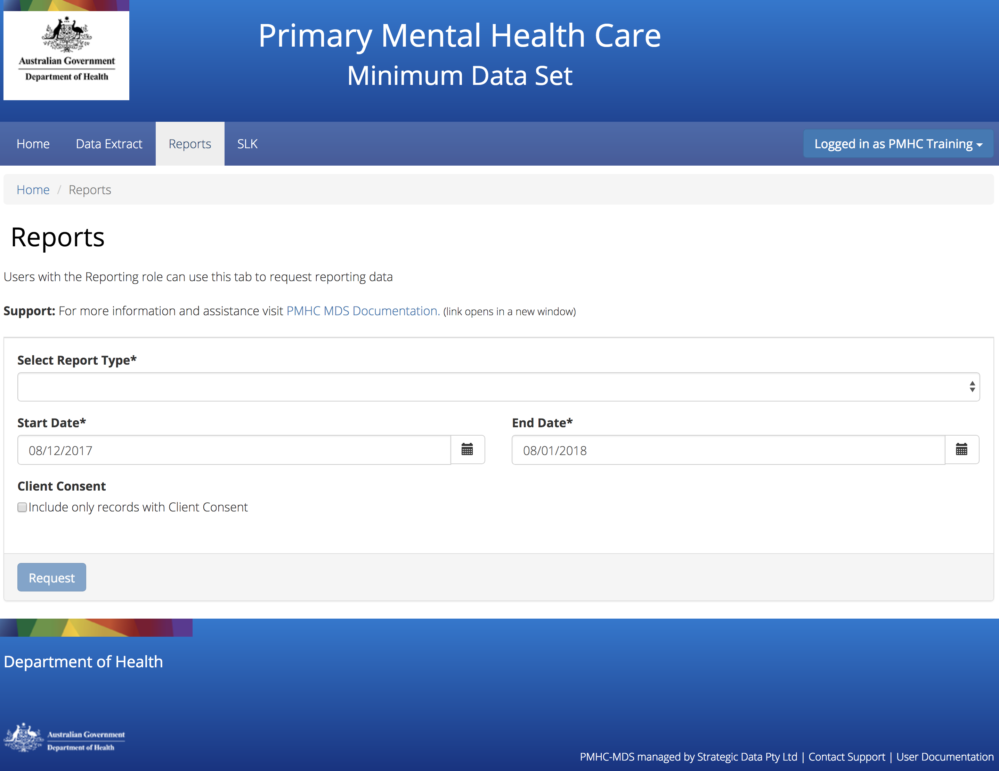
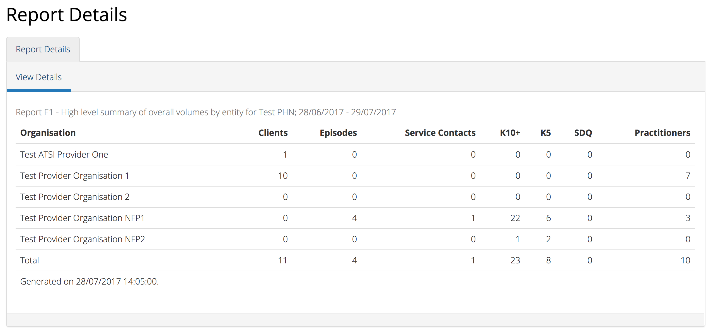
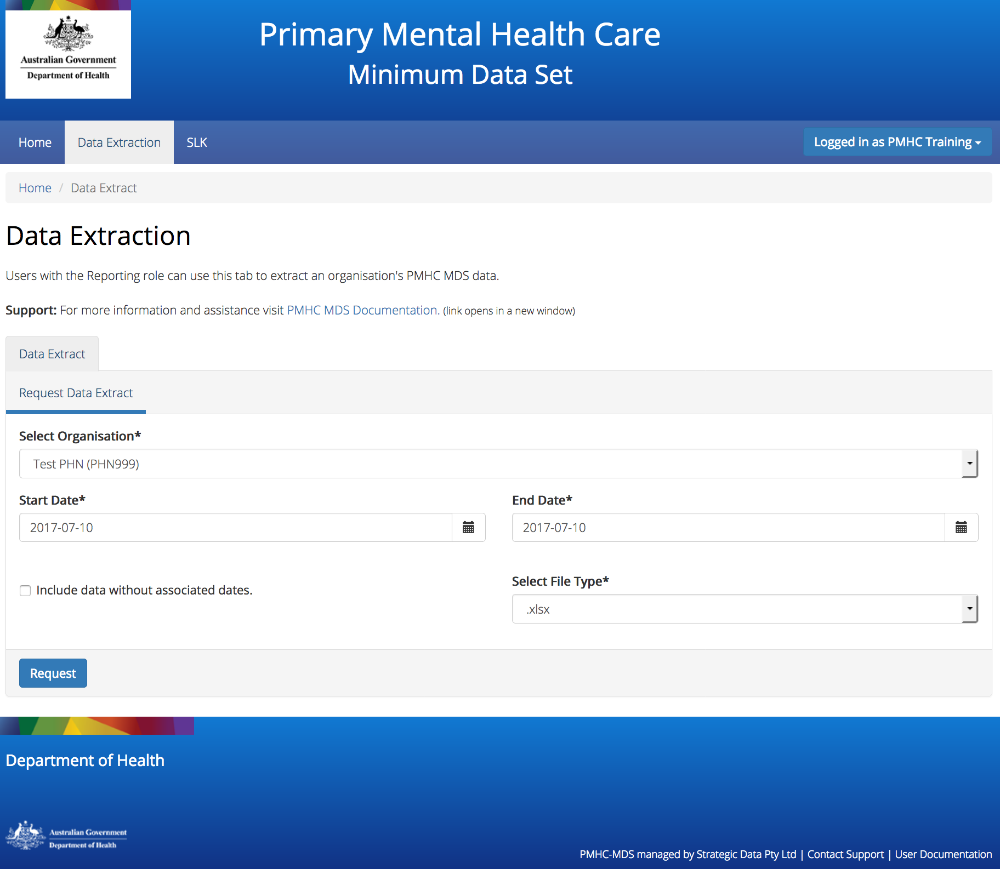

.. _reports:

Reports
=======

You will only be able to see the Reports tab if you have been assigned
the 'Reporting' :ref:`roles`, when logged into the PMHC MDS on https://pmhc-mds.net.

If you don’t have access to the Reports tab and you believe you should, please
contact someone in your provider organisation or provider organisation's PHN
who has the 'User Management' role. If you are unsure who has the 'User Management'
role please email the PMHC Helpdesk at support@pmhc-mds.com

After navigating to the Reports tab, you will be presented with two tabs -
:ref:`system-reports` and :ref:`data-extraction`.

.. _system-reports:

System Reports
^^^^^^^^^^^^^^

.. _produce-system-report:

How to produce a report
-----------------------

You can produce a system report by completing the fields in the Systems Reports
tab by following these steps:

1. Navigate to the 'System Reports tab' that is contained within the 'Reports' tab.

.. figure:: screen-shots/system-reports.png
   :alt: Reports tab View

2. Select the type of report you would like to produce.
3. If you are allowed to produce reports for more than one organisation you
   will be asked to select an organisation name.
4. Select the name of the organisation from the drop down list.
5. Click the first calendar icon to select the start date and then the second
   calendar icon to select the end date.
6. Click the blue ‘Request’ button.
7. Your report will be displayed.

.. _system-report-types:

Types of System Reports
-----------------------

The reports are grouped into five categories, each designed to serve different
purposes:

* Category A: Monitoring progress of MDS implementation
* Category B: Monitoring overall service delivery
* Category C: Monitoring implementation of stepped care
* Category D: Key Performance Indicators
* :ref:`category-e`

**Note:** Category A-D reports are still to be implemented.

.. _category-e:

Category E: Reports for data managers to monitor data supply
++++++++++++++++++++++++++++++++++++++++++++++++++++++++++++

These reports are designed to assist in monitoring the amount and type of data
that has been input into the MDS.

They are based on a subset of Category A reports but differ in two important ways:

* The reports are based on ‘raw data’, not filtered or trimmed by any data
  quality censoring. Comparable Category A reports restrict the reported data
  by specific edit criteria (e.g., Category A reports are only based on
  ‘active clients’, ‘active episodes’ and ‘active providers’).

* All dates refer to date of upload. Comparable Category A reports are based on
  date of service.

Category E reports are specifically designed to enable PHN and Provider
Organisation data managers to monitor upload and data supply to the MDS.

The reports provide summary data on:

* Raw volumes (clients/episodes/service contacts/collection occasions/practitioners) over time periods
* Raw volumes per day (clients/episodes/service contacts/collection occasions/practitioners)

.. _category-e1:

E1 - High level summary of overall volumes by entity
~~~~~~~~~~~~~~~~~~~~~~~~~~~~~~~~~~~~~~~~~~~~~~~~~~~~

This report is designed to provide a ‘one page’ view, with data aggregated for the
specified reporting period, covering counts of clients, episodes, service contacts,
collection occasions and practitioners, without any filtering for business rules.

Key specifications:

* All records to be counted with no filtering.
* All dates refer to date of modification, not date of service.

E2 - Volume trends
~~~~~~~~~~~~~~~~~~

This report is designed to show volume trends in clients, episodes, service
contacts, collection occasions and practitioners.

Key specifications:

* All records to be counted with no filtering.
* All dates refer to date of insertion, not date of service.
* Results are cumulative.

E3 - Activity per day
~~~~~~~~~~~~~~~~~~~~~

This report will show a summary of the number of clients, episodes, service
contacts, collections occasions and practitioners added or modified each day.
Its purpose is to give entities information about when and how much data was
added or modified.

Key specifications:

* All records to be counted with no filtering.
* All dates refer to date of modification, not date of service.

.. _data-extraction:

Data Extract
^^^^^^^^^^^^

After navigating to the Data Extraction tab, you will be presented with a
Request Data Extract.

.. _view-data-extract:

How to download an organsiation's data
--------------------------------------

You can extract a PHN's or provider organisation's PMHC MDS data by completing
the Download Data fields in the Data Extraction tab, by following these steps:

1. Navigate to the 'Data Extract' tab that is contained within the 'Reports' tab.
2. If you are allowed to download data from more than one organisation you will be
   asked to select an organisation name.
3. Select the name of the organisation from the drop down list.
4. Click the first calendar icon to select the start date and then the second
   calendar icon to select the end date.
5. Click the 'Include data without associated dates' checkbox, if required.

   **Please note:** As the query is date based the following data will not by
   default be included in the extract:

   * The start date of an episode is derived from the date of the first service contact.
     Therefore, if an episode doesn't have any associated service contacts, there will be
     no start date for the episode and they will not by default be included in the data extract.
   * Clients that don't have any associated episodes, or who are associated
     with an episode with no service contacts also will not by default be included in the data extract.
   * Practitioners who are not associated with a service contact will not by default be included
     in the data extract.

   If you would like to include these episodes, clients and practitioners check the
   the 'Include data without associated dates' checkbox.

6. Select the File Type you'd like this data downloaded in.

   .. figure:: screen-shots/data-extract-view-form.png
      :alt: PMHC MDS File Selected

7. Click the blue 'Request' button.
8. A dialogue box will be displayed, showing that the file is being requested from the server.

.. figure:: screen-shots/data-requesting-message.png
   :alt: PMHC MDS File Selected

9. When the file is ready, a 'File ready for download' message will be displayed.

.. figure:: screen-shots/data-download-message.png
   :alt: PMHC MDS File Selected

10. Click the blue 'Download' button.
11. Your data extract will be downloaded to your computer.

.. _data-extract-dates:

Dates explained for Data Extract
--------------------------------

The Data Extract dates are based on the Client's Service Contact dates.

**Please note:** As the query is date based the following data will not by
default be included in the extract:

   * The start date of an episode is derived from the date of the first service contact.
     Therefore, if an episode doesn't have any associated service contacts, there will be
     no start date for the episode and they will not by default be included in the data extract.
   * Clients that don't have any associated episodes, or who are associated
     with an episode with no service contacts also will not by default be included in the data extract.
   * Practitioners who are not associated with a service contact will not by default be included
     in the data extract.

If you would like to include these episodes, clients and practitioners check the
the 'Include data without associated dates' checkbox.

See :ref:`view-data-extract`.
