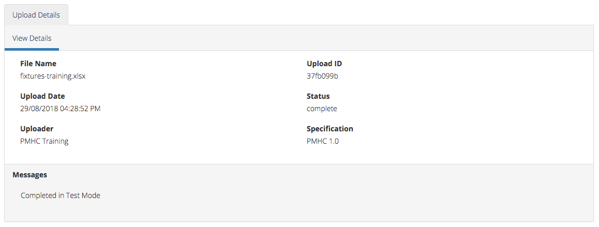
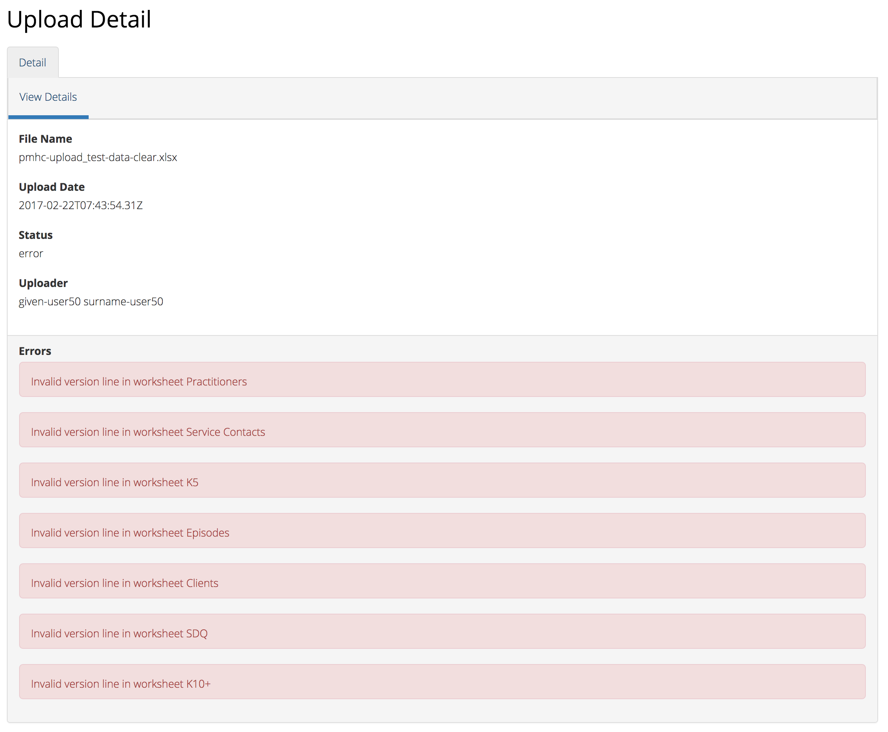

.. _upload:

Upload
======

You will only be able to see the Upload tab if you have been assigned
the 'Upload' role.

If you don’t have access to the Upload tab and you believe you should, please
contact someone in your provider organisation or provider organisation's PHN
who has the 'User Management' role.

If you are unsure who has the 'User Management' role please email the
PMHC helpdesk at support@pmhc-mds.com

After navigating to the Upload tab, you will be presented with a drop down list
of the organisations to which you can upload.

.. figure:: screen-shots/upload.png
   :alt: PMHC MDS Upload

.. _uploading-a-file:

Uploading a file
^^^^^^^^^^^^^^^^

After navigating to the Upload tab, you will be able to upload
data files to organisations for which you have the 'Upload' role.

You can upload data files through the upload tab, by following these steps:

1. Navigate to the 'Upload' tab.
2. If you are allowed to upload to more than one organisation you will be
   asked to select an organisation name.
3. Select the name of the PHN whose data you are uploading from the drop down list.

   .. figure:: screen-shots/upload-org-selected.png
      :alt: PMHC MDS Organisation Selected

4. Click the blue 'Select File' button.
5. Navigate to where the upload file is saved on your system. Select the file
   and click the grey 'Open' button.

   .. figure:: screen-shots/file-selected.png
      :alt: PMHC MDS File Selected

6. Check to ensure you have selected the correct file by reviewing the file
   name now displayed below the 'Select File' button.

7. Click the green 'Upload' button.

You will receive confirmation that your file has been accepted. The file will
now be validated and you will shortly receive an email informing you if
your file was successfully uploaded to the PMHC MDS, or informing you of
any errors that occurred. Further discussion about the error messages can be
found at :ref:`upload-error-messages`. Please email support@pmhc-mds.com if you don't
receive an email within one hour.

.. _uploading-a-file-in-test-mode:

Uploading a file in Test Mode
^^^^^^^^^^^^^^^^^^^^^^^^^^^^^

A file can be uploaded in Test Mode. When uploading in test mode, the file is
validated, however the data is not updated in the PMHC MDS database.

After navigating to the Upload tab, you will be able to upload in Test Mode
data files to organisations for which you have the 'Upload' role.

You can upload data files in Test Mode through the upload tab, by following these steps:

1. Navigate to the 'Upload' tab.
2. If you are allowed to upload to more than one organisation you will be
   asked to select an organisation name.
3. Select the name of the organisation whose data you are uploading from the drop down list.
4. Click the blue 'Select File' button.
5. Navigate to where the upload file is saved on your system. Select the file
   and click the grey 'Open' button.
6. Check to ensure you have selected the correct file by reviewing the file
   name now displayed below the 'Select File' button.

7. Click the 'Upload as test data' checkbox on the right hand side.

   .. figure:: screen-shots/test-mode.png
      :alt: PMHC MDS Test Mode selected

8. Click the green 'Upload' button.

You will receive confirmation that your file has been accepted. The file will
now be validated and you will shortly receive an email informing you if
your file was valid, or informing you of any errors that occurred.

*Even if your file was valid, the data will not be updated in the PMHC MDS database.*

.. _viewing-previous-uploads:

Viewing Previous Uploads
^^^^^^^^^^^^^^^^^^^^^^^^

The PMHC MDS allows you to review previous uploads. At the bottom of the Upload
tab there is a 'Status of Previous Uploads' table.

If you need to see a test upload please check the 'Show test uploads' checkbox.

   .. figure:: screen-shots/previous-upload.png
      :alt: PMHC MDS Status of Previous Uploads

When an upload has been completed, irregardless of whether it validated successfully
or not, the upload will be added to the table.

The 'Status of Previous Uploads' table refreshes every 60 seconds. Types of status results are:

  * **accept** - the file is currently going through the validation process
  * **complete** - the file has successfully passed the validation process
  * **error** - the file has returned errors through the validation process. Please review the error messages and correct the data to upload again

Further discussion about the error messages can be found at :ref:`upload-error-messages`. Please email support@pmhc-mds.com if you don't
receive an email within one hour.

.. _viewing-uploads-details:

Viewing Upload Details
^^^^^^^^^^^^^^^^^^^^^^

You can view the results of an upload by following these steps:

1. Navigate to the 'Upload' tab.
2. Click the 'Upload Status' tab.
3. Locate the date and time of the upload you are interested in.
4. Click on the filename of the relevant upload.
5. You will be shown the 'Upload Detail' page.

.. _viewing-complete-uploads:

Complete uploads
^^^^^^^^^^^^^^^^

:ref:`viewing-uploads-details` for complete uploads will display data verification
information by listing the number of data records present and if those records
are added or uploaded within the MDS records.

.. _upload-error-messages:

Error messages
^^^^^^^^^^^^^^

If the status of your file shows error, you can view the returned errors through :ref:`viewing-previous-uploads`.

.. figure:: screen-shots/upload-details-error.png
   :alt: PMHC MDS Upload Details error page

The definition of each data item has associated notes that will provide guidance on why an error is returned. By visiting the data specifications documentation and clicking on the :ref:`record-formats` field name this will take you to the field definition which outlines the associated notes.

Please email support@pmhc-mds.com if you require assistance in understanding an error message.

Below are some example error messages, and how to fix them:

Could not find worksheet [Name]
~~~~~~~~~~~~~~~~~~~~~~~~~~~~~~~

This error occurs when you are uploading and Excel spreadsheet. The worksheet
names need to exactly match the name in the 'Excel worksheet name' column
of the 'Summary of files to upload' table at :ref:`files-to-upload`. If all the
required worksheets are not present you will receive the error above.

Invalid version line in worksheet [Name]
~~~~~~~~~~~~~~~~~~~~~~~~~~~~~~~~~~~~~~~~

The top line of the worksheet must include the following columns:

+------------+---------------+
| Version    | 1.0           |
+------------+---------------+

Column [Name] is not valid
~~~~~~~~~~~~~~~~~~~~~~~~~~

Each item is a column in the file/worksheet. The 'Field Name' should be used for
the column headings. These values can be found at :ref:`file-format`, or
listed on the provided example file at :ref:`files-to-upload`. If the Column [Name]
doesn't match identically you will receive the error above.

Organisation_path is not valid on row ...
~~~~~~~~~~~~~~~~~~~~~~~~~~~~~~~~~~~~~~~~~

The organisation path provided does not map to a valid organisation. The format
should be a combination of your PHN key and the provider organisation key,
separated with a colon. Example PHN_key:POrg_key. If the organisation path
doesn't match identically you will receive the error above.

Invalid version number on row 1.
~~~~~~~~~~~~~~~~~~~~~~~~~~~~~~~~

You need to record a valid version number on row 1, in column 2. Column one will
include the word Version, Column two should inclue a number.We are currently
only accepting Version 1, or Version 1.X eg 1.0 or 1.1 . If the version number
doesn't match identically you will receive the error above.

Column [Name] is required on row ...
~~~~~~~~~~~~~~~~~~~~~~~~~~~~~~~~~~~~

There is a required field that has not been entered. If not supplied, insert the
default 'Missing' or 'Not recorded' value. These values can be found at :ref:`record-formats`.
If the Column [Name] is blank in a mandatory field you will receive the error above.

Could not parse worksheet [Name]: Bad request at ...
~~~~~~~~~~~~~~~~~~~~~~~~~~~~~~~~~~~~~~~~~~~~~~~~~~~~

Something has gone wrong with the upload. Please contact support@pmhc-mds.com.
