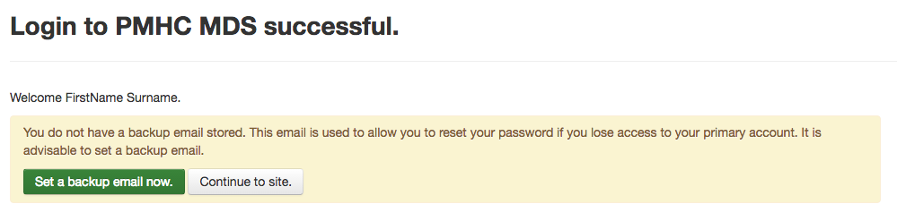

Home
====

To use the PMHC MDS navigate to https://pmhc-mds.net/

The first page you will see is the Home page. The home page shows you the
most recent announcements made via the :ref:`mailing-list`.

.. figure:: screen-shots/home-page.png
   :alt: PMHC MDS Home Page

.. _logging_in:

Logging In
^^^^^^^^^^

After navigating to https://pmhc-mds.net/ click the 'Sign in' button to login.

.. figure:: screen-shots/sign-in.png
   :alt: PMHC MDS Sign In

You will be presented with a login form. Enter your email address or username
and then your password and click 'Sign in'.

*Please note - the PMHC MDS will automatically log out users after 15
minutes of inactivity.  You will see a pop up box that will provide a count
down feature prior to automatically logging out the idle user.*

.. _setting_backup_email:

If it is your first time logging in, you will be asked to set a backup email
address.

The backup email address is used when resetting your password. If you forget
your password an email is sent to both your primary email address and your
backup email address. This allows you to regain access to your account in the
event that you no longer have access to your primary email address.

1. Click 'Set a backup email now.'
2. You will be shown the manage details page.

   .. figure:: screen-shots/set-backup-email.png
      :alt: PMHC MDS Setting Backup Email

3. Under 'Manage Security Credentials' there will be an 'Email address' field.
4. Type in your backup email.
5. Click 'Submit'

   .. figure:: screen-shots/backup-email-success.png
      :alt: PMHC MDS Backup Email Success message

6. You now need to confirm the email address. You will have been sent an email
   to the address you specified and an SMS to the mobile phone number we have on
   record. Please follow the link in the email and enter the code that
   has been sent to your mobile.

   .. figure:: screen-shots/verify-user.png
      :alt: PMHC MDS User Verification

7. Click 'Submit'
8. Your backup email is now confirmed.

   .. figure:: screen-shots/confirm-update-email.png
      :alt: PMHC MDS Confirm Update Email

9. Navigate back to https://pmhc-mds.net/ and sign in.
10. What you see once you login will depend upon what roles you have been
    assigned. The table below lists the tabs that will be shown for each role:

    +-------------------------+----------------------+
    | Role                    | Tab                  |
    +=========================+======================+
    | Organisation Management | Organisations        |
    +-------------------------+----------------------+
    | User Management         | Organisations, Users |
    +-------------------------+----------------------+
    | Upload                  | Upload               |
    +-------------------------+----------------------+
    | All users               | SLK                  |
    +-------------------------+----------------------+

.. _forgotten_password:

Forgotten or Expired Password
^^^^^^^^^^^^^^^^^^^^^^^^^^^^^

Passwords have to be changed every 3 months. If you do not change your
password it will expire and you will not be able to login to the system
without resetting your password.

If you have forgotten your password or it has expired:

1. Navigate to https://pmhc-mds.net/ and click the 'Sign in' button.
2. Click 'Forgot Password'.

   .. figure:: screen-shots/resetting-password.png
      :alt: PMHC MDS Resetting Password

3. You will be prompted to enter your email address or user name recorded
   for the PMHC MDS.
4. Click the 'I'm not a robot' checkbox.
5. Click 'Submit'.
6. An email with further instructions will be sent to the email address the
   PMHC MDS has on file. Additionally, if you have set a backup email, then
   an email will also have been sent there. An SMS with a verification code
   will have been sent to the mobile phone number we have on record.

   .. figure:: screen-shots/reset-password-success.png
      :alt: PMHC MDS Resetting Password

7. Follow the link in the email.

   .. figure:: screen-shots/verify-user.png
      :alt: PMHC MDS User Verification

8. Enter the verification code you were SMS'ed.
9. Click 'Submit'.
10. You will be shown a 'Password reset' page.

   .. figure:: screen-shots/password-reset.png
      :alt: PMHC MDS Password Reset

11. Enter your new password.
12. Confirm you new password.
13. Click 'Submit'.
14. Your password will be reset.

   .. figure:: screen-shots/password-reset-success.png
      :alt: PMHC MDS Password Reset Success

15. Navigate back to https://pmhc-mds.com/ and sign in.

Logging Out
^^^^^^^^^^^

Once logged in, logout by:

1. Clicking on the button to the right of the menubar that says 'Logged in as [Name]'.
2. A drop down menu will appear.
3. Click 'Logout'.

We highly encourage users to logout once they have completed their tasks.

.. _updating_your_details:

Updating your details
^^^^^^^^^^^^^^^^^^^^^

Once signed in, to edit your details:

1. Click on the button to the right of the menubar that says 'Logged in as [Name]'.
2. A drop down menu will appear.
3. Click 'Profile'.
4. You will be taken to the Profile Management system.
5. Login using your PMHC MDS email/username and password.
6. You will see the 'Manage Details' page.

   .. figure:: screen-shots/manage-details.png
      :alt: PMHC MDS Manage Details

7. To update your name, click the 'Change personal details' link.
8. To update your primary email address, click the 'Change email address' link.
9. To update your backup email address, click the 'Change backup email address
   link.
10. To update your mobile phone number, click the 'Change mobile phone number'
    link.
11. The last section on the page 'Password lifetime', tells you when
    you last changed your password and when it will expire. Passwords have
    to be changed every 3 months.
