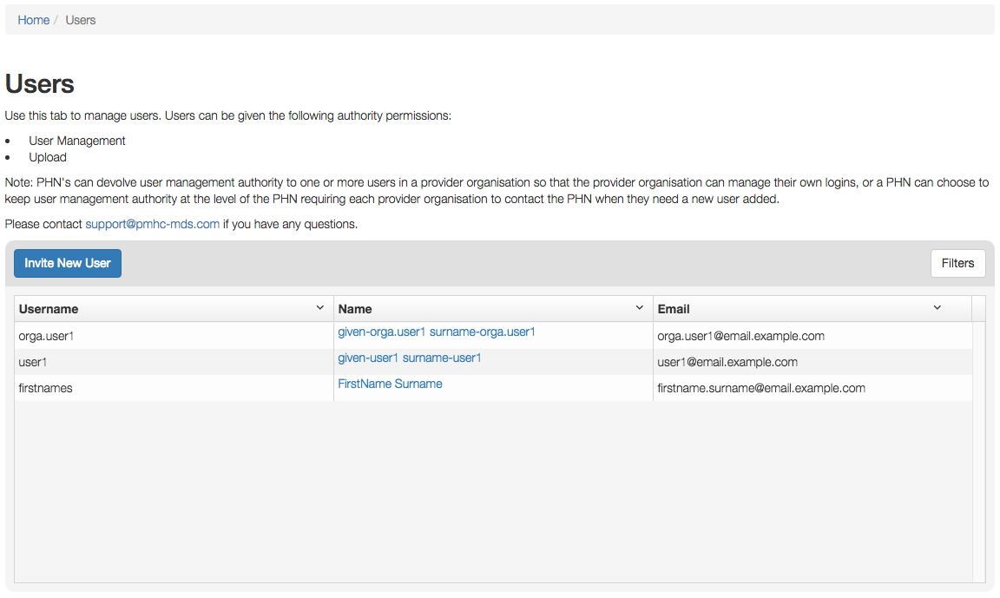

Users
=====

You will only be able to see the Users tab if you have been assigned
the 'User Management' role.

If you don’t have access to the Users tab and you believe you should, please
contact someone in your provider organisation or provider organisation's PHN
who has the 'User Management' role.

If you are unsure who has the 'User Management' role please email the
PMHC helpdesk at support@pmhc-mds.com

After navigating to the Users tab, you will be presented with a list of the
users that are assigned to the organisations for which you have the
'User Management' role.

.. _roles:

Users Roles
^^^^^^^^^^^

Access to the PMHC MDS is based around roles. The following table provides a summary of each of
the roles that currently exist within the PMHC MDS:

+----------------------------+------------------------------------------------------------------------------------------------------------------------------------+
| **Role**                   | **Tasks allowed**                                                                                                                  |
+============================+====================================================================================================================================+
| Organisation Management    | A user with the Organisation Management role for a PHN can manage provider organisations for that PHN                              |
+----------------------------+------------------------------------------------------------------------------------------------------------------------------------+
| User Management            | A user with the User Management role for an organisation can manage user accounts for that organisation                            |
+----------------------------+------------------------------------------------------------------------------------------------------------------------------------+
| Upload                     | A user with the Upload role can upload data to the associated organisation                                                         |
+----------------------------+------------------------------------------------------------------------------------------------------------------------------------+

Each role allows a user to perform specific tasks. A user can have more than one role.
Each role is granted for a user against an organisation. An organisation can
either be a Primary Health Network or a Provider Organisation. If a user is granted
a role for a Primary Health Network (PHN) they will also have this role for any
Provider Organisation's of that PHN.

What users see once they are loged in will depend upon what roles they have been
assigned. The table below lists the tabs that will be shown for each role:

+-------------------------+----------------------+
| Role                    | Tab                  |
+=========================+======================+
| Organisation Management | Organisations        |
+-------------------------+----------------------+
| User Management         | Organisations, Users |
+-------------------------+----------------------+
| Upload                  | Upload               |
+-------------------------+----------------------+
| All users               | SLK                  |
+-------------------------+----------------------+

Finding a user
^^^^^^^^^^^^^^

You can sort and filter the listed users through the Users tab.

Sort the listed users by simply clicking on the column header. Alternately
you can click on the arrow beside a column header for more sort options, as follows:

- Sort Ascending
- Sort Descending
- Remove Sort
- Hide Column

To filter the listed users:

1. Click the grey 'Filters' button.
2. Start typing in an edit box now displayed under the column headers.

.. figure:: screen-shots/users-filter.png
   :alt: PMHC MDS Users Filter

3. To remove the filter, click the grey cross within the edit box beside any
   entered text.

Viewing a User's details
^^^^^^^^^^^^^^^^^^^^^^^^

You can view a user's details through the user tab, by following these steps:

#. Navigate to the Users tab.
#. Click on the user's name in blue displayed within the table list.

.. figure:: screen-shots/view-user.png
   :alt: PMHC MDS View User

A page will display showing the user's details and the :ref:`roles` they have at
particular organisations.

.. _adding_a_user:

Adding a user
^^^^^^^^^^^^^

Note: PHNs can devolve user management authority to one or more users in a
provider organisation so that the provider organisation can manage their own
logins, or a PHN can choose to keep user management authority at the level of
the PHN requiring each provider organisation to contact the PHN when they need
a new user added.

The first step to adding a new user is to invite the potential user to the
PMHC MDS.  You can invite a new user through the Users tab, by following these steps:

1. Navigate to the Users tab.
2. Click the blue 'Invite New User' button.

   .. figure:: screen-shots/invite-user.png
      :alt: PMHC MDS Invite User

3. Complete all the mandatory fields marked with an * in the 'Invite User' form.
   Only one :ref:`roles` can be selected at this stage. User's can be given multiple
   roles. If more than one role is required the extra roles will need to be
   added after the user has access to the system.

   .. figure:: screen-shots/invite-user-filled-in.png
      :alt: PMHC MDS Invite User Complete

4. Click the blue 'Invite' button.
5. You will receive confirmation that the user has been sent an email to invite
   them to the PMHC MDS. They will also be sent an SMS containing a
   verification code. The user will need to follow the instructions in the
   email before they can gain access to the system.
6. When the user has accepted the invitation you will be sent an email to let you know.

   .. figure:: screen-shots/invite-accepted-email.png
      :alt: PMHC MDS Invite Accepted

7. If the user requires more than one role you can now follow the
   instructions at :ref:`adding_roles`. Also update the organisation's contact details,
   if a new user is the organisation's primary contact.

.. _accepting_invitation:

Accepting an invitation to become a PMHC MDS User
^^^^^^^^^^^^^^^^^^^^^^^^^^^^^^^^^^^^^^^^^^^^^^^^^

To become a PMHC MDS user you will be sent an invitation by email and a
verification code via SMS. In order to gain access to the PMHC MDS you
will need to accept this invitation as follows:

.. figure:: screen-shots/invitation-email.png
   :alt: PMHC MDS Invitation Email

1. Click on the link contained in the email. You will be shown a page where
   you will need to input the SMS you have been sent.

   .. figure:: screen-shots/verify-user.png
      :alt: PMHC MDS Verify User

2. Input your verification code.
3. Click 'Submit'.
4. You will be shown a page where you need to choose a password.

   .. figure:: screen-shots/activate-account.png
      :alt: PMHC MDS Activate Account

5. Enter your password.
6. Confirm your password.
7. Click 'Submit'.
8. Your account will now be activated.

   .. figure:: screen-shots/account-activated.png
      :alt: PMHC MDS Account Activated

9. Navigate to https://pmhc-mds.net/ and follow the :ref:`logging_in`
   instructions.

Adding a role to an existing user
^^^^^^^^^^^^^^^^^^^^^^^^^^^^^^^^^

A user can have more than one role. Each role is granted for a user against an organisation.
View :ref:`adding_roles` to assign extra roles to an existing organisational user.
